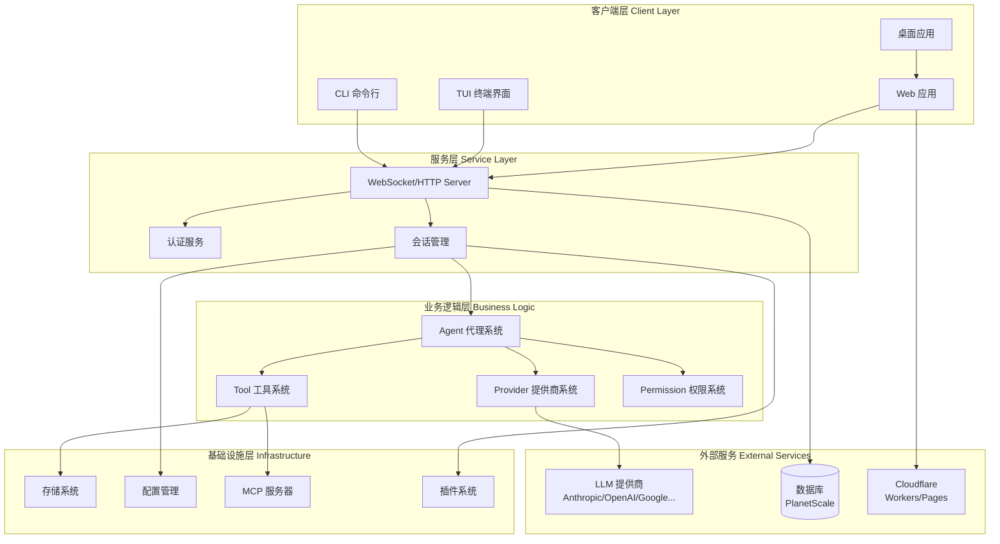
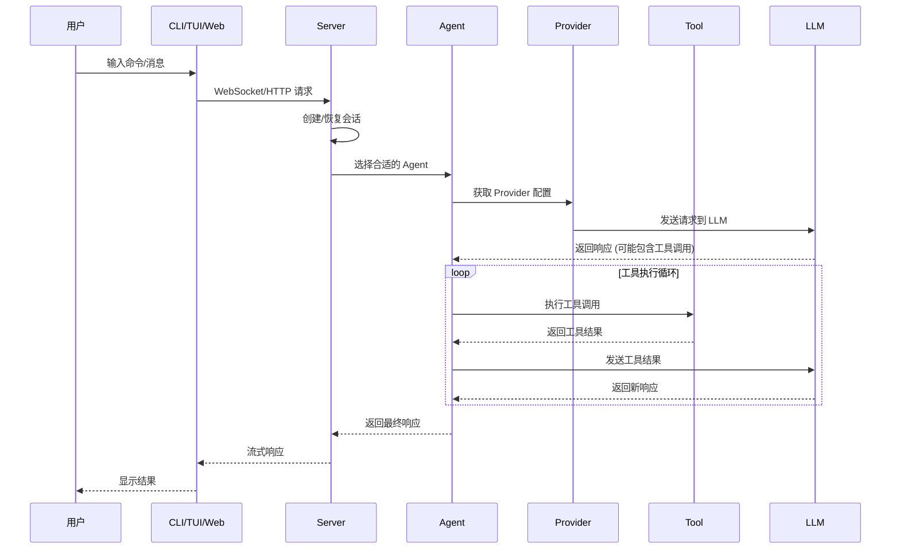
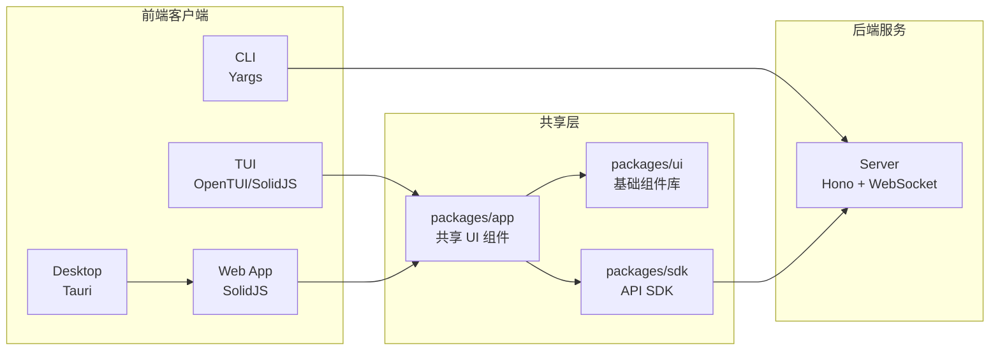
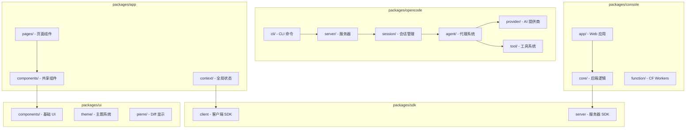
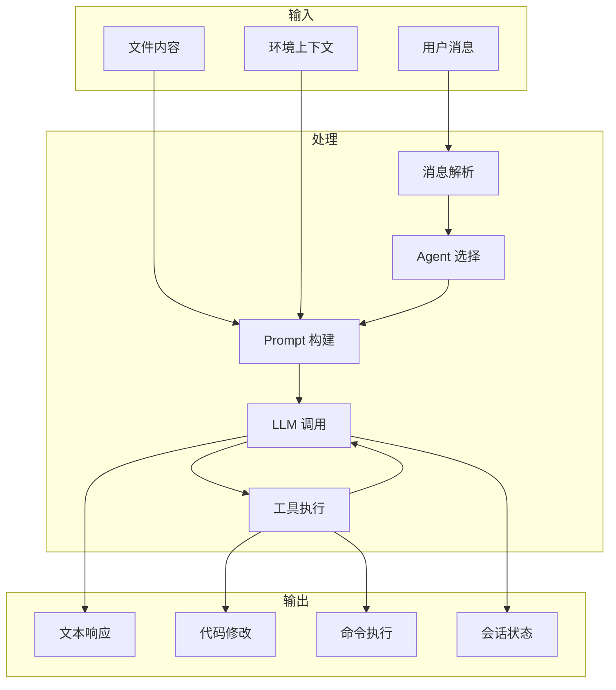

# OpenCode 总体架构概览

## 1. 项目概述

OpenCode 是一个模块化的、基于 monorepo 的 AI 驱动开发工具，使用 Bun、TypeScript 和 SolidJS 构建。它采用分层架构，将 CLI、TUI、Web UI、后端服务和核心业务逻辑清晰分离。

## 2. 目录结构总览

```
opencode/
├── packages/               # Monorepo 工作区包
│   ├── opencode/           # 核心 CLI 应用 & 服务器逻辑
│   ├── console/            # 管理控制台 & 仪表板
│   ├── app/                # 共享 Web UI (SolidJS)
│   ├── desktop/            # Tauri 原生桌面应用
│   ├── web/                # Astro 文档站点
│   ├── ui/                 # UI 组件库 (SolidJS)
│   ├── sdk/                # 客户端/服务器 SDK
│   ├── plugin/             # 插件系统 & 接口
│   ├── util/               # 共享工具函数
│   └── ...
├── infra/                  # 基础设施即代码 (SST/Pulumi)
├── themes/                 # UI 主题
└── sdks/                   # 非 JS SDK
```

## 3. 核心架构图



## 4. 请求处理流程



## 5. 多客户端统一架构



## 6. 技术栈概览

| 层级 | 技术 |
|------|------|
| **运行时** | Bun 1.3.5 |
| **语言** | TypeScript 5.8 |
| **UI 框架** | SolidJS 1.9 |
| **样式** | Tailwind CSS v4 |
| **桌面** | Tauri v2 |
| **文档** | Astro + Starlight |
| **后端** | Hono (边缘函数) |
| **数据库** | PlanetScale (MySQL) + Drizzle ORM |
| **AI 集成** | Vercel AI SDK |
| **代码解析** | Tree-sitter |
| **终端** | PTY (bun-pty) |
| **构建** | Vite, esbuild, Turbo |
| **基础设施** | SST + Cloudflare |

## 7. 核心包职责



## 8. 数据流架构



## 9. 相关文档

- [OpenCode 核心包架构](./02-opencode-core.md)
- [会话与代理系统](./03-session-agent.md)
- [工具系统架构](./04-tool-system.md)
- [Provider 系统](./05-provider-system.md)
- [UI 与客户端架构](./06-ui-client.md)
- [Console 后台管理系统](./07-console-system.md)
