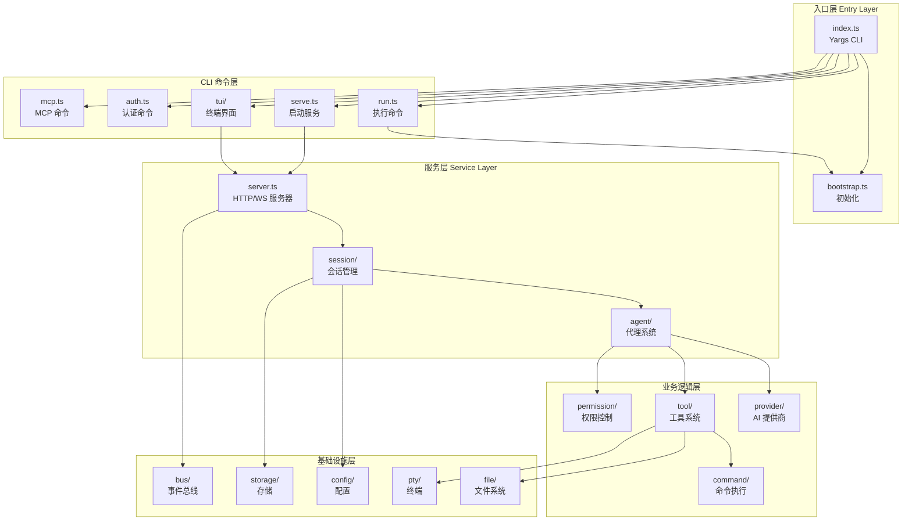
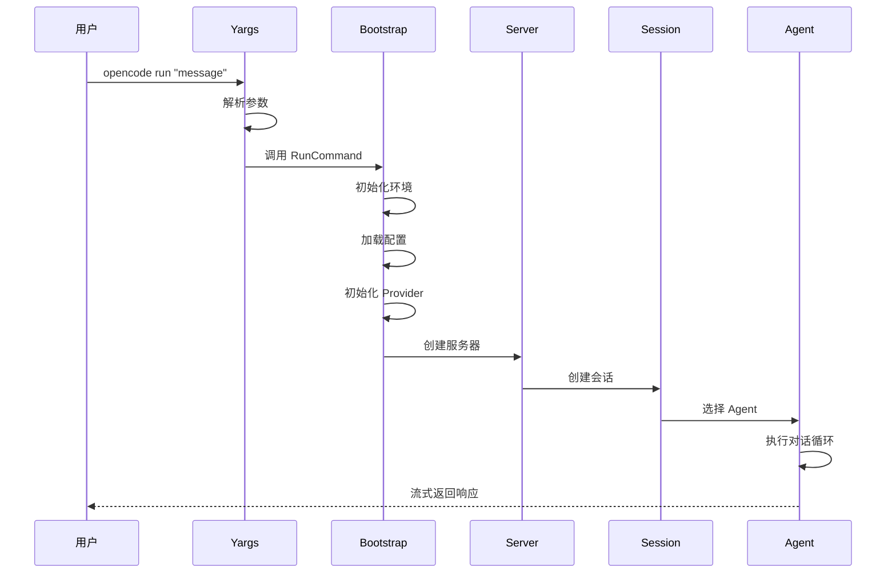
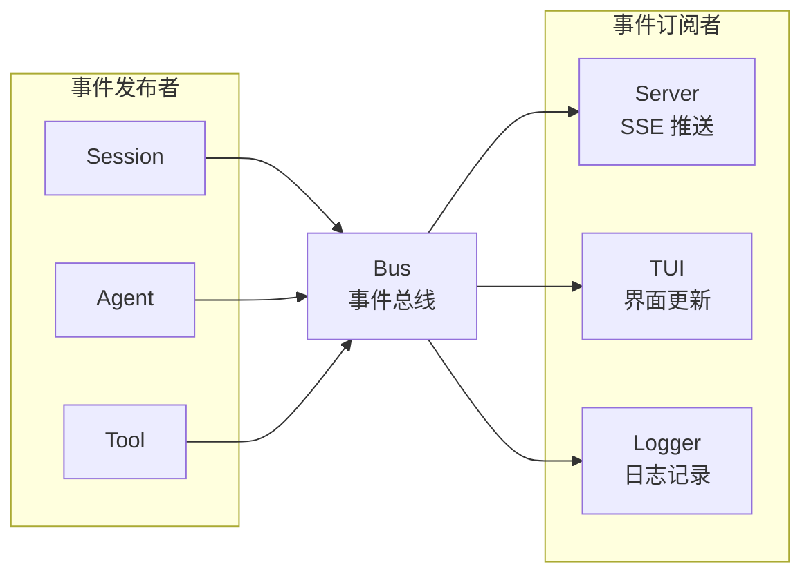
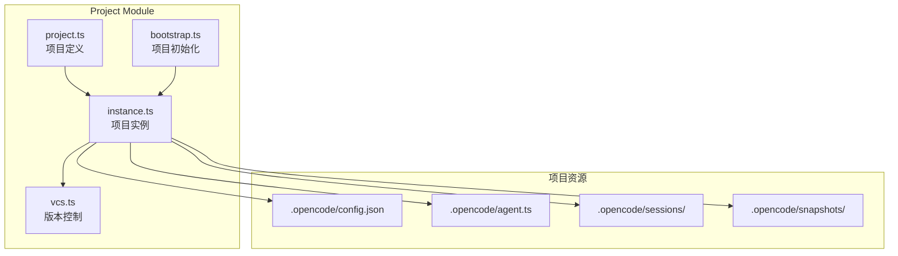
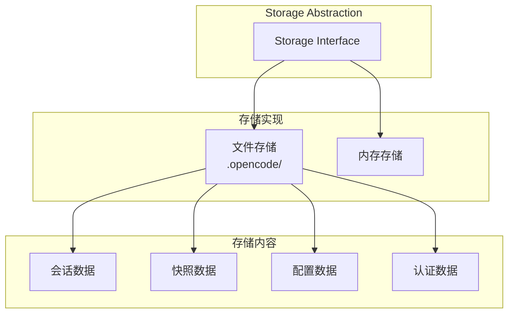
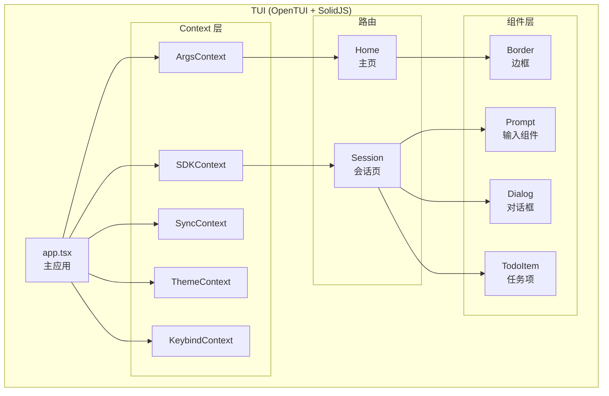
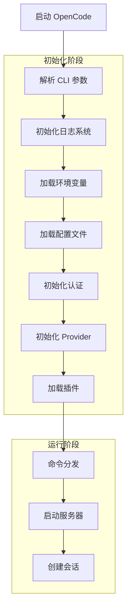

# OpenCode 核心包架构

## 1. 概述

`packages/opencode` 是 OpenCode 的核心包，包含 CLI 应用程序、服务器逻辑、Agent 系统、Provider 集成等核心功能。

## 2. 目录结构

```
packages/opencode/src/
├── index.ts           # CLI 入口点 (Yargs)
├── acp/               # Agent Control Protocol
├── agent/             # Agent 代理系统
├── auth/              # 认证管理
├── bun/               # Bun 运行时工具
├── bus/               # 事件总线系统
├── cli/               # CLI 命令和 TUI
│   ├── cmd/           # CLI 命令实现
│   └── bootstrap.ts   # 启动引导
├── command/           # 命令执行框架
├── config/            # 配置管理
├── env/               # 环境变量
├── file/              # 文件系统操作
├── flag/              # 功能标志
├── format/            # 格式化工具
├── global/            # 全局状态
├── id/                # ID 生成
├── ide/               # IDE 集成
├── installation/      # 安装管理
├── lsp/               # 语言服务器协议
├── mcp/               # Model Context Protocol
├── patch/             # 代码补丁
├── permission/        # 权限系统
├── plugin/            # 插件系统
├── project/           # 项目管理
├── provider/          # AI Provider 系统
├── pty/               # PTY 终端
├── question/          # 问题交互
├── server/            # HTTP/WebSocket 服务器
├── session/           # 会话管理
├── share/             # 共享功能
├── shell/             # Shell 集成
├── skill/             # 技能系统
├── snapshot/          # 快照系统
├── storage/           # 存储抽象
├── tool/              # 工具系统
├── util/              # 工具函数
└── worktree/          # Git Worktree 管理
```

## 3. 核心模块架构图



## 4. CLI 命令执行流程



## 5. 主要 CLI 命令

| 命令 | 文件 | 功能 |
|------|------|------|
| `run` | `cli/cmd/run.ts` | 执行单次对话 |
| `serve` | `cli/cmd/serve.ts` | 启动 HTTP 服务器 |
| `tui` | `cli/cmd/tui/` | 启动终端界面 |
| `auth` | `cli/cmd/auth.ts` | 认证管理 |
| `agent` | `cli/cmd/agent.ts` | Agent 管理 |
| `mcp` | `cli/cmd/mcp.ts` | MCP 服务器管理 |
| `pr` | `cli/cmd/pr.ts` | PR 处理 |
| `session` | `cli/cmd/session.ts` | 会话管理 |
| `models` | `cli/cmd/models.ts` | 模型列表 |
| `github` | `cli/cmd/github.ts` | GitHub 集成 |

## 6. 服务器架构

```mermaid
graph TB
    subgraph "Server (Hono)"
        CORS[CORS 中间件]
        AUTH[Basic Auth]
        LOG[日志中间件]

        subgraph "路由"
            HEALTH[/global/health]
            EVENT[/global/event<br/>SSE]
            SESSION_API[/session/*<br/>会话 API]
            TOOL_API[/tool/*<br/>工具 API]
            PROVIDER_API[/provider/*<br/>Provider API]
            PROJECT_API[/project/*<br/>项目 API]
            WS[WebSocket<br/>实时通信]
        end
    end

    CLIENT[客户端<br/>CLI/TUI/Web] --> CORS
    CORS --> AUTH
    AUTH --> LOG
    LOG --> HEALTH
    LOG --> EVENT
    LOG --> SESSION_API
    LOG --> TOOL_API
    LOG --> PROVIDER_API
    LOG --> PROJECT_API
    LOG --> WS
```

## 7. 事件总线系统



## 8. 项目管理模块



## 9. 存储系统



## 10. TUI 架构



## 11. 初始化流程



## 12. 关键依赖

| 依赖 | 用途 |
|------|------|
| `yargs` | CLI 参数解析 |
| `hono` | HTTP 服务器框架 |
| `zod` | 数据验证 |
| `ai` (Vercel AI SDK) | AI 模型集成 |
| `tree-sitter` | 代码解析 |
| `bun-pty` | PTY 终端模拟 |
| `remeda` | 函数式工具库 |

## 13. 相关文档

- [会话与代理系统](./03-session-agent.md)
- [工具系统架构](./04-tool-system.md)
- [Provider 系统](./05-provider-system.md)
