# 会话与代理系统架构

## 1. 概述

会话 (Session) 和代理 (Agent) 系统是 OpenCode 的核心，负责管理用户与 AI 之间的对话交互、任务执行和状态管理。

## 2. Agent 代理系统

### 2.1 Agent 类型

| Agent | 模式 | 描述 | 权限 |
|-------|------|------|------|
| `build` | primary | 默认代理，完整功能访问 | 完全访问 + 提问 |
| `plan` | primary | 只读规划代理 | 只读 + 计划退出 |
| `general` | subagent | 通用子代理，执行多步任务 | 无 Todo 访问 |
| `explore` | subagent | 代码探索专用代理 | 只读 + 搜索 |
| `compaction` | primary (hidden) | 上下文压缩代理 | 最小权限 |
| `title` | primary (hidden) | 标题生成代理 | 最小权限 |
| `summary` | primary (hidden) | 摘要生成代理 | 最小权限 |

### 2.2 Agent 架构图

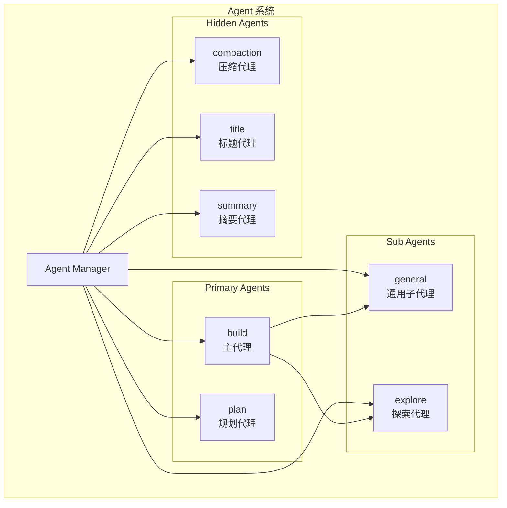

### 2.3 Agent 配置结构

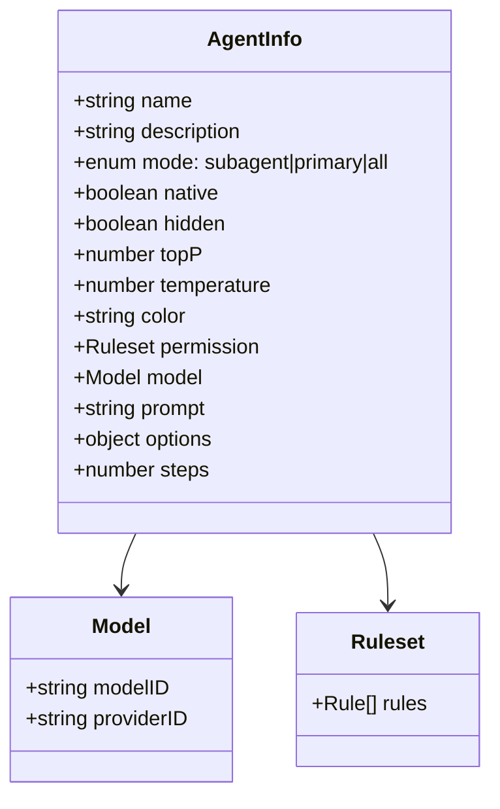

### 2.4 Agent 权限系统

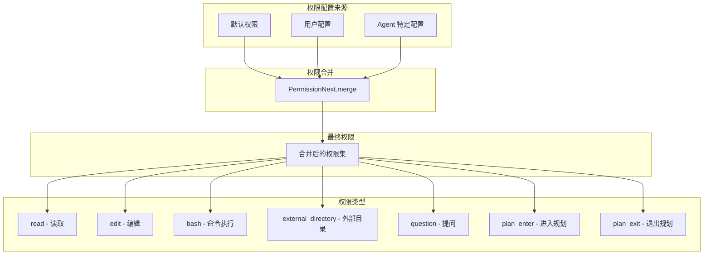

## 3. Session 会话系统

### 3.1 Session 数据结构

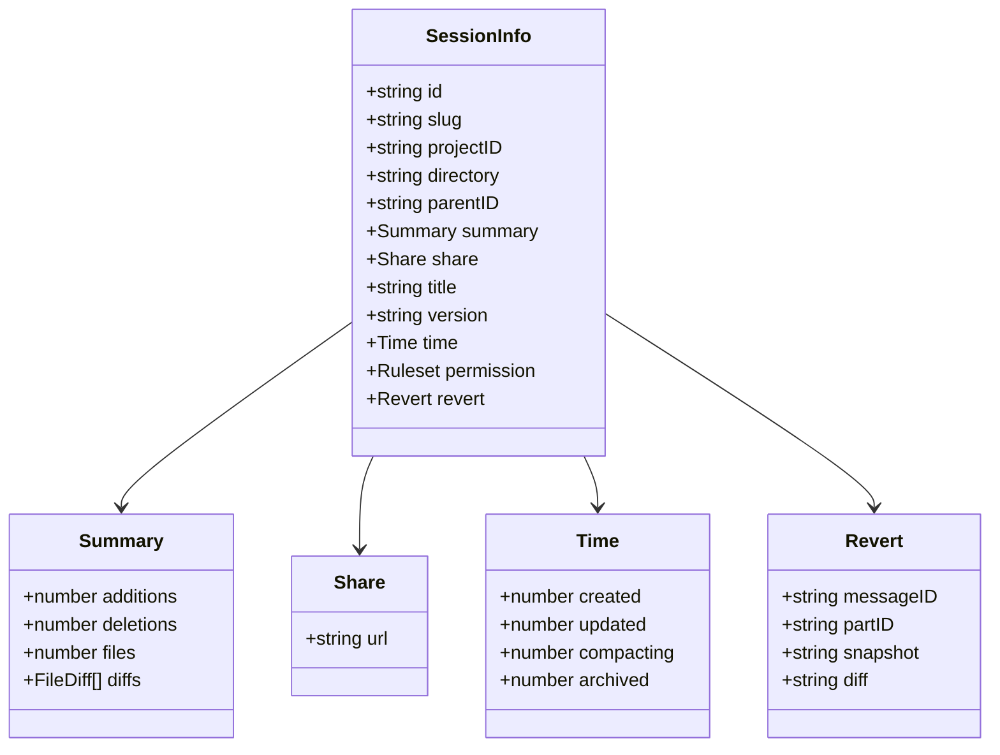

### 3.2 Session 生命周期

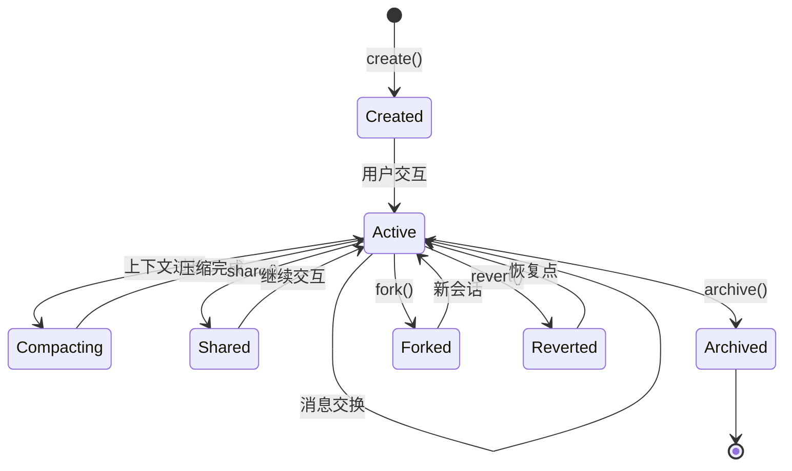

### 3.3 Session 事件系统

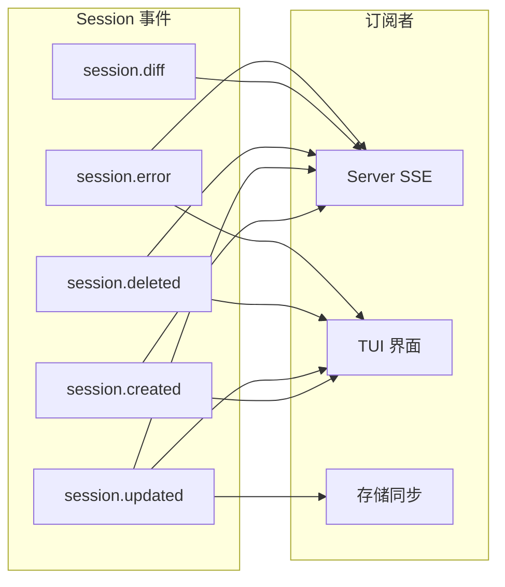

### 3.4 消息处理流程

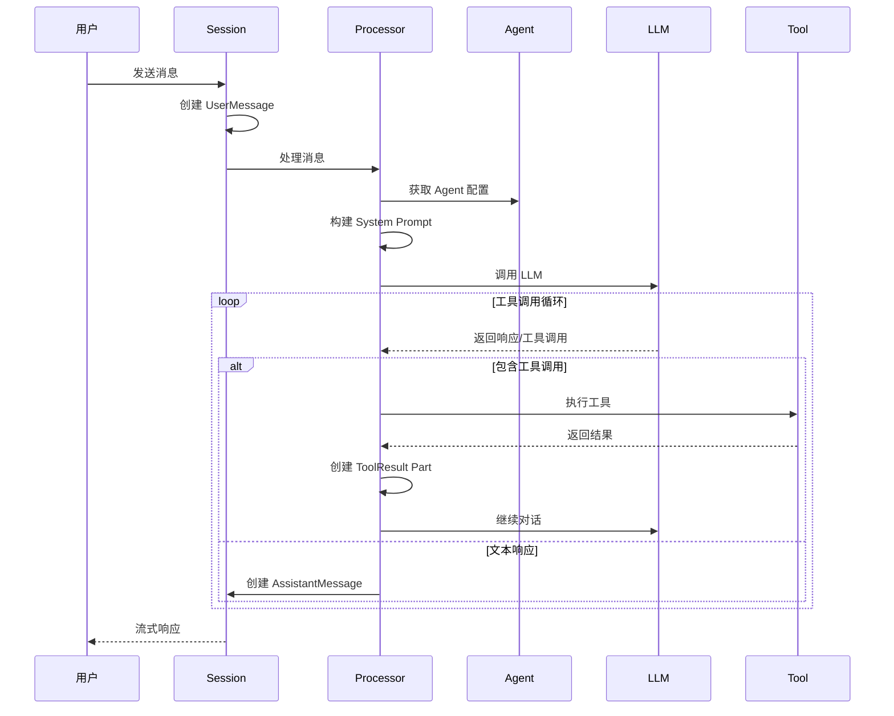

## 4. 消息系统

### 4.1 消息类型

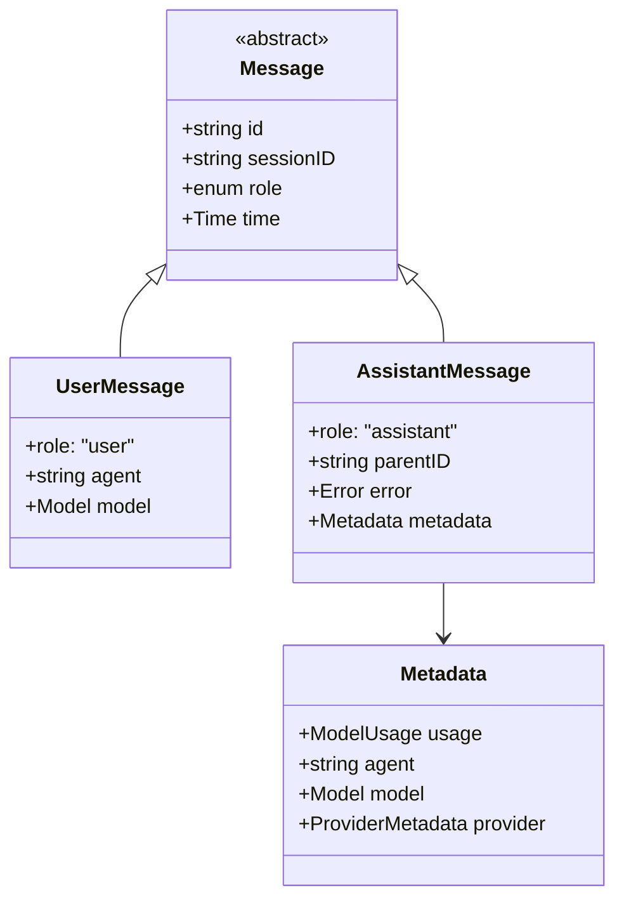

### 4.2 消息 Part 类型

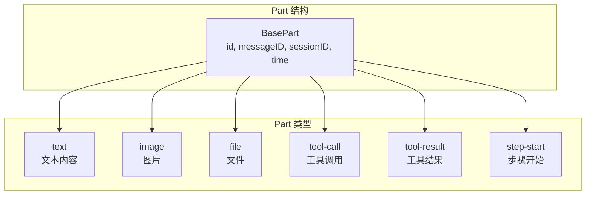

## 5. Session 存储结构

```mermaid
graph TB
    subgraph "存储路径"
        ROOT[.opencode/]
        SESSIONS[sessions/]
        SESSION_DIR[{sessionID}/]
        MESSAGES[messages/]
        PARTS[parts/]
        SNAPSHOTS[snapshots/]
    end

    ROOT --> SESSIONS
    SESSIONS --> SESSION_DIR
    SESSION_DIR --> MESSAGES
    SESSION_DIR --> PARTS
    SESSION_DIR --> SNAPSHOTS

    subgraph "文件内容"
        SESSION_JSON[session.json<br/>会话元数据]
        MSG_JSON[{messageID}.json<br/>消息数据]
        PART_JSON[{partID}.json<br/>Part 数据]
        SNAP_FILE[{snapshotID}<br/>快照文件]
    end

    SESSION_DIR --> SESSION_JSON
    MESSAGES --> MSG_JSON
    PARTS --> PART_JSON
    SNAPSHOTS --> SNAP_FILE
```

## 6. 上下文压缩 (Compaction)

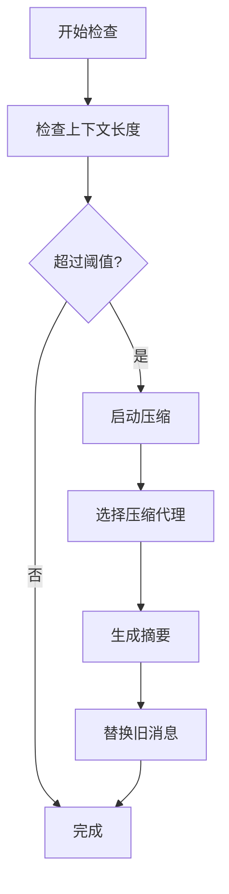

## 7. 会话执行主循环

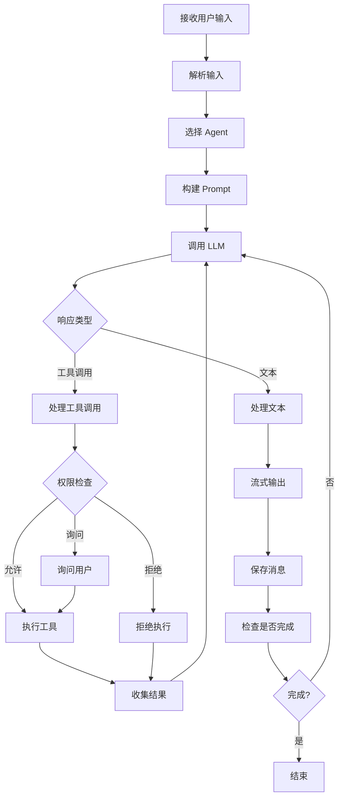

## 8. 子代理调用流程

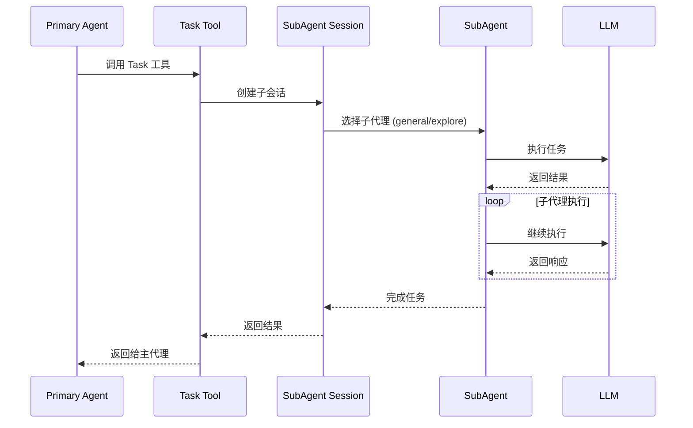

## 9. 会话恢复与回滚

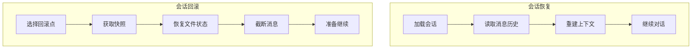

## 10. 关键文件

| 文件 | 功能 |
|------|------|
| `session/index.ts` | 会话管理核心 |
| `session/message-v2.ts` | 消息数据结构 |
| `session/prompt.ts` | Prompt 构建 |
| `session/processor.ts` | 消息处理器 |
| `session/compaction.ts` | 上下文压缩 |
| `session/llm.ts` | LLM 调用封装 |
| `session/system.ts` | System Prompt |
| `session/todo.ts` | Todo 管理 |
| `agent/agent.ts` | Agent 定义与管理 |

## 11. 相关文档

- [工具系统架构](./04-tool-system.md)
- [Provider 系统](./05-provider-system.md)
- [权限系统详解](./08-permission-system.md)
