# 工具系统架构

## 1. 概述

工具系统是 OpenCode 的核心能力层，允许 AI 代理执行各种操作，包括文件读写、命令执行、代码搜索、网络请求等。

## 2. 工具列表

### 2.1 核心工具

| 工具 ID | 文件 | 功能描述 |
|---------|------|----------|
| `bash` | `bash.ts` | 执行 Shell 命令 |
| `read` | `read.ts` | 读取文件内容 |
| `edit` | `edit.ts` | 编辑文件 |
| `write` | `write.ts` | 写入文件 |
| `glob` | `glob.ts` | 文件模式匹配 |
| `grep` | `grep.ts` | 文本搜索 |
| `ls` | `ls.ts` | 目录列表 |

### 2.2 高级工具

| 工具 ID | 文件 | 功能描述 |
|---------|------|----------|
| `task` | `task.ts` | 子代理任务 |
| `webfetch` | `webfetch.ts` | 网页内容获取 |
| `websearch` | `websearch.ts` | 网络搜索 |
| `codesearch` | `codesearch.ts` | 代码搜索 |
| `skill` | `skill.ts` | 技能调用 |
| `question` | `question.ts` | 向用户提问 |

### 2.3 状态管理工具

| 工具 ID | 文件 | 功能描述 |
|---------|------|----------|
| `todowrite` | `todo.ts` | 写入 Todo |
| `todoread` | `todo.ts` | 读取 Todo |
| `plan_enter` | `plan.ts` | 进入规划模式 |
| `plan_exit` | `plan.ts` | 退出规划模式 |

### 2.4 实验性工具

| 工具 ID | 文件 | 功能描述 |
|---------|------|----------|
| `batch` | `batch.ts` | 批量操作 |
| `lsp` | `lsp.ts` | LSP 集成 |
| `multiedit` | `multiedit.ts` | 多文件编辑 |
| `patch` | `patch.ts` | 补丁应用 |

## 3. 工具系统架构图

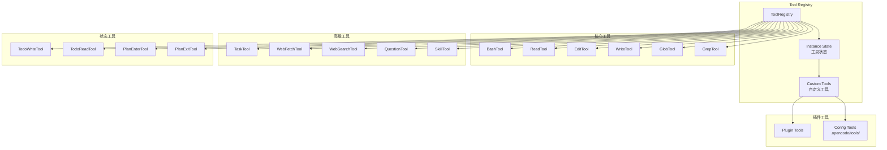

## 4. 工具定义结构

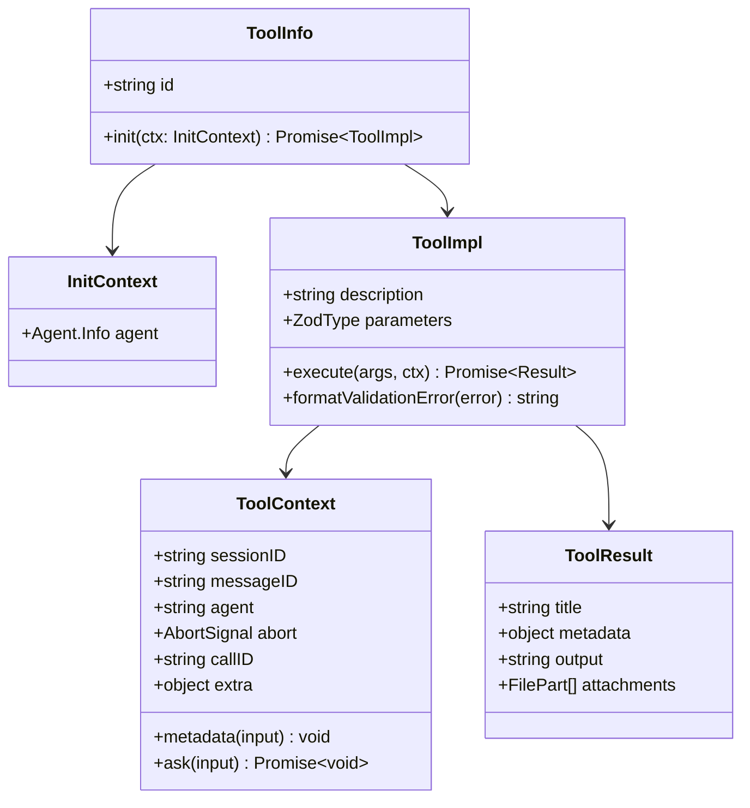

## 5. 工具执行流程

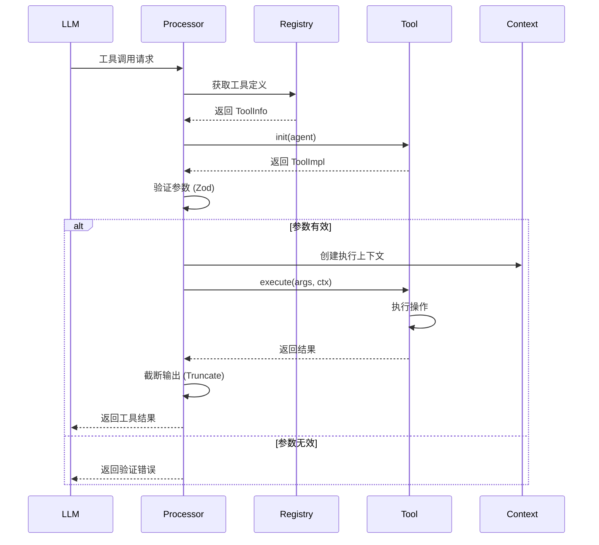

## 6. 工具注册流程

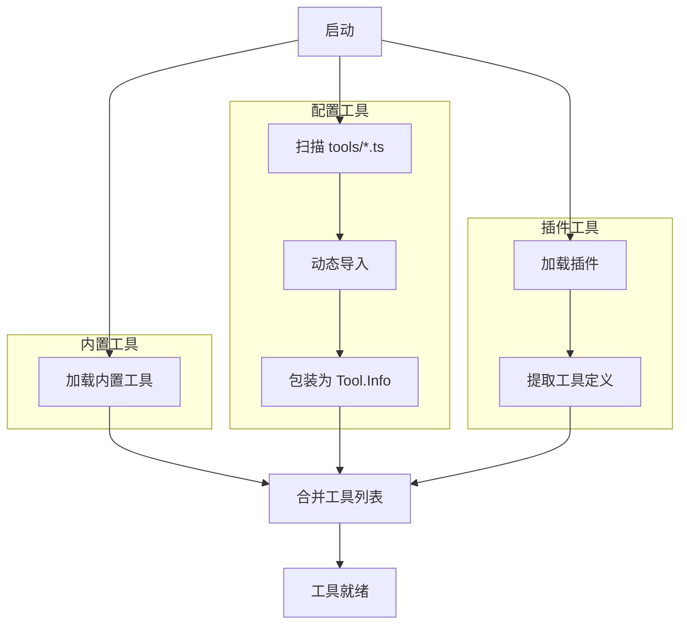

## 7. 权限检查流程

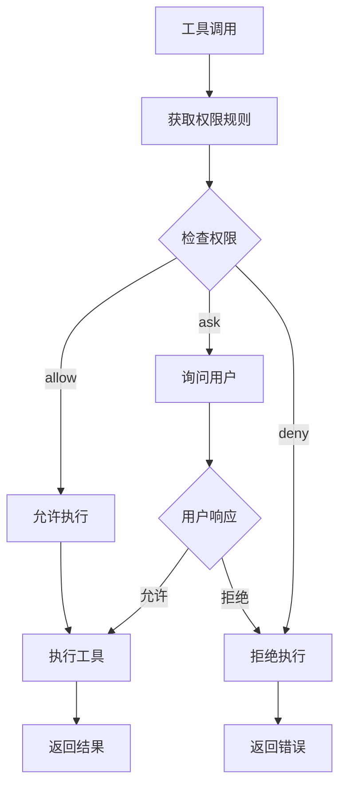

## 8. 输出截断系统

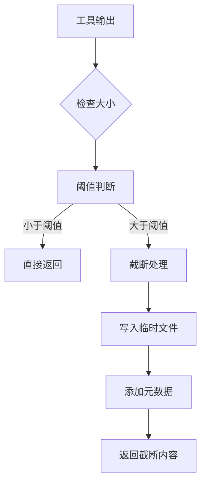

## 9. 核心工具详解

### 9.1 Bash 工具

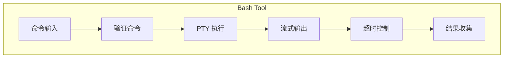

### 9.2 Edit 工具

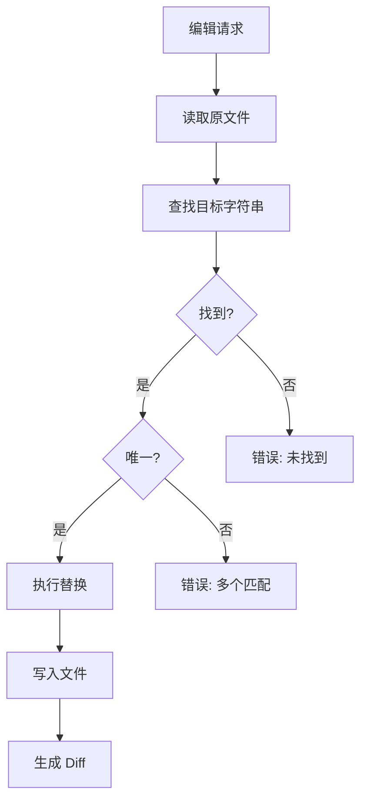

### 9.3 Task 工具 (子代理)

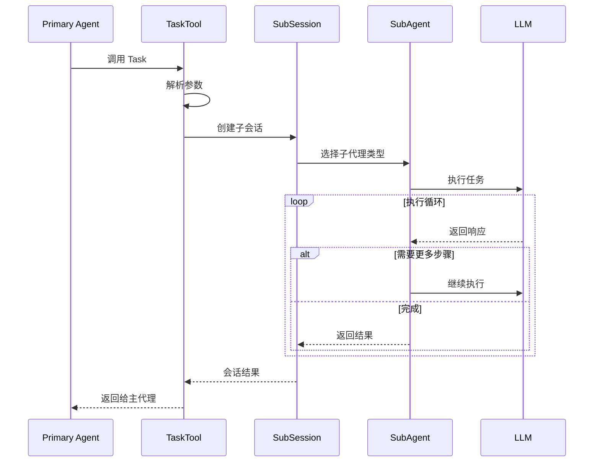

## 10. 自定义工具开发

### 10.1 工具定义示例

```typescript
// .opencode/tools/my-tool.ts
import { z } from "zod"
import type { ToolDefinition } from "@opencode-ai/plugin"

export default {
  description: "My custom tool description",
  args: {
    input: z.string().describe("Input parameter"),
  },
  execute: async (args, ctx) => {
    // 工具实现逻辑
    return `Result: ${args.input}`
  },
} satisfies ToolDefinition
```

### 10.2 工具加载路径

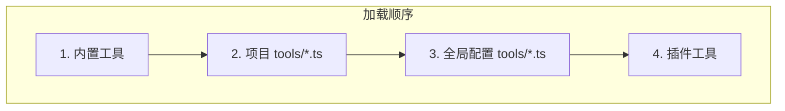

## 11. 工具上下文

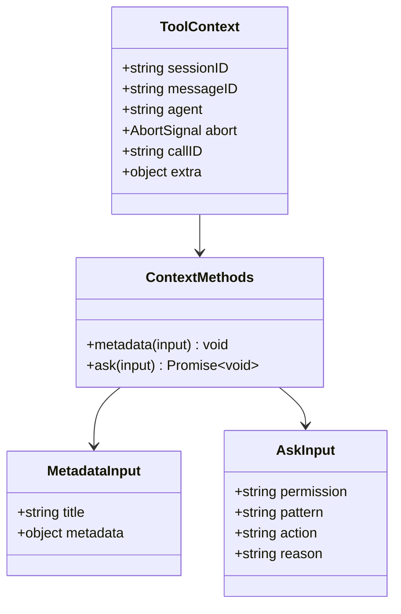

## 12. 关键文件

| 文件 | 功能 |
|------|------|
| `tool/registry.ts` | 工具注册中心 |
| `tool/tool.ts` | 工具基础定义 |
| `tool/truncation.ts` | 输出截断 |
| `tool/bash.ts` | Bash 执行 |
| `tool/edit.ts` | 文件编辑 |
| `tool/read.ts` | 文件读取 |
| `tool/task.ts` | 子代理任务 |
| `tool/question.ts` | 用户提问 |

## 13. 相关文档

- [会话与代理系统](./03-session-agent.md)
- [Provider 系统](./05-provider-system.md)
- [权限系统详解](./08-permission-system.md)
