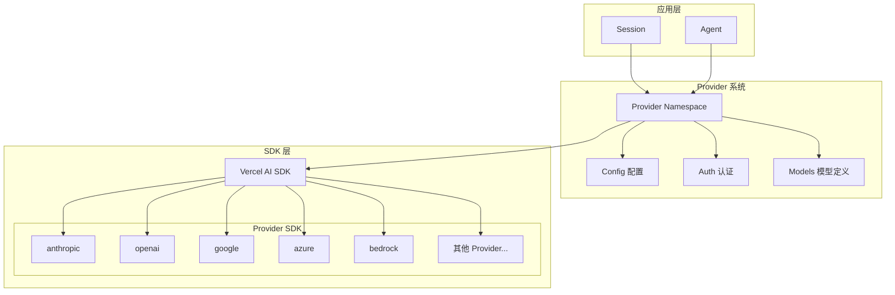
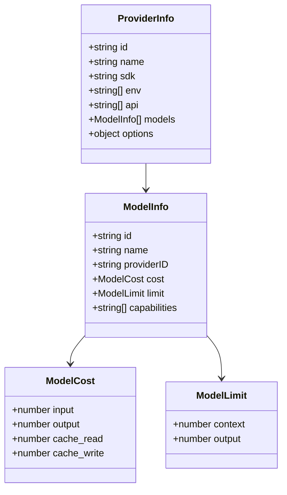
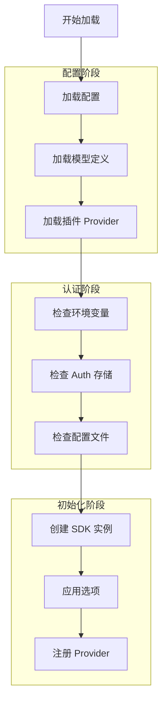
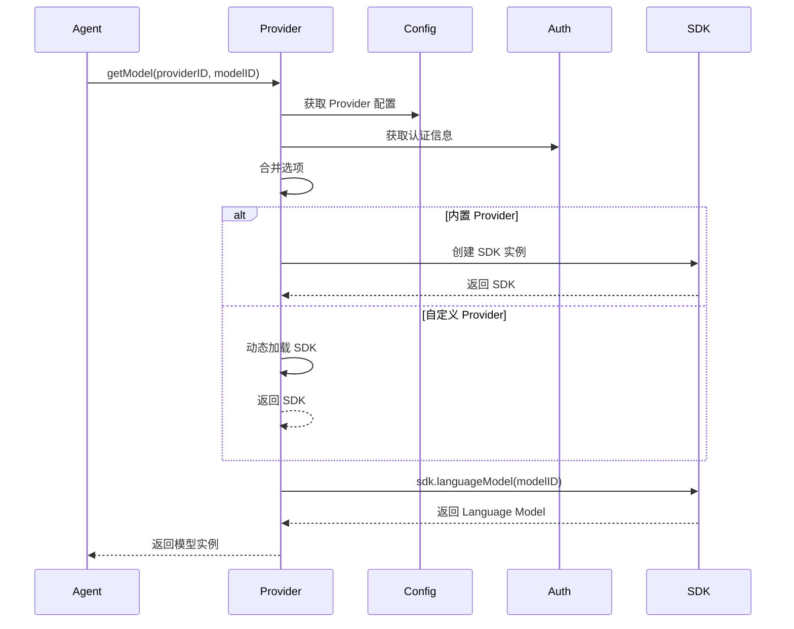
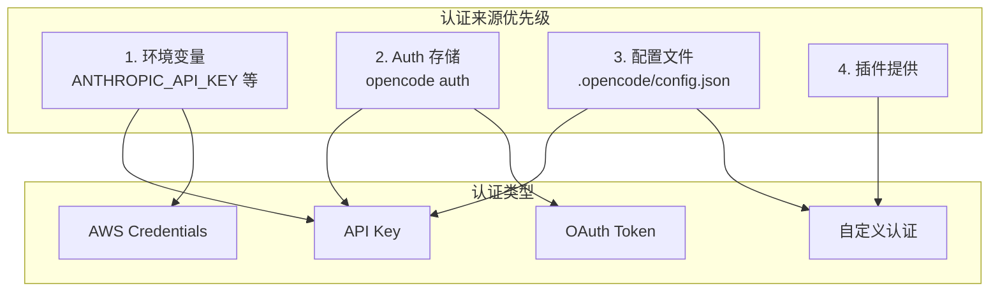
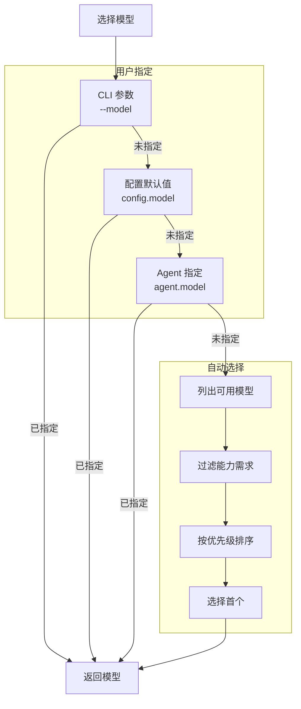
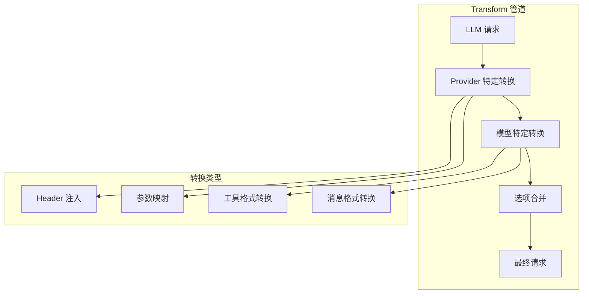
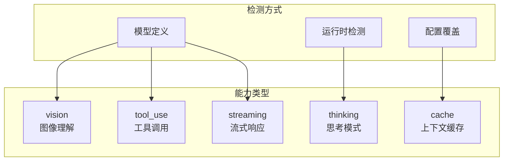

# Provider 系统架构

## 1. 概述

Provider 系统是 OpenCode 与各种 AI 模型提供商之间的抽象层，支持 20+ 个 AI 提供商，提供统一的接口进行模型调用。

## 2. 支持的 Provider

### 2.1 主要 Provider

| Provider ID | SDK 包 | 描述 |
|-------------|--------|------|
| `anthropic` | `@ai-sdk/anthropic` | Claude 模型 |
| `openai` | `@ai-sdk/openai` | GPT 模型 |
| `google` | `@ai-sdk/google` | Gemini 模型 |
| `opencode` | 内置 | OpenCode 托管服务 |

### 2.2 云服务 Provider

| Provider ID | SDK 包 | 描述 |
|-------------|--------|------|
| `azure` | `@ai-sdk/azure` | Azure OpenAI |
| `amazon-bedrock` | `@ai-sdk/amazon-bedrock` | AWS Bedrock |
| `google-vertex` | `@ai-sdk/google-vertex` | Google Vertex AI |
| `vercel` | `@ai-sdk/vercel` | Vercel AI |

### 2.3 第三方 Provider

| Provider ID | SDK 包 | 描述 |
|-------------|--------|------|
| `openrouter` | `@openrouter/ai-sdk-provider` | OpenRouter |
| `groq` | `@ai-sdk/groq` | Groq |
| `mistral` | `@ai-sdk/mistral` | Mistral AI |
| `cohere` | `@ai-sdk/cohere` | Cohere |
| `deepinfra` | `@ai-sdk/deepinfra` | DeepInfra |
| `togetherai` | `@ai-sdk/togetherai` | Together AI |
| `perplexity` | `@ai-sdk/perplexity` | Perplexity |
| `cerebras` | `@ai-sdk/cerebras` | Cerebras |
| `xai` | `@ai-sdk/xai` | xAI (Grok) |

### 2.4 代码助手 Provider

| Provider ID | SDK 包 | 描述 |
|-------------|--------|------|
| `github-copilot` | 自定义 | GitHub Copilot |
| `gitlab` | `@gitlab/gitlab-ai-provider` | GitLab AI |

## 3. Provider 架构图



## 4. Provider 数据结构



## 5. Provider 加载流程



## 6. 模型获取流程



## 7. Provider 认证系统



## 8. Provider 配置结构

```yaml
# .opencode/config.json
{
  "provider": {
    "anthropic": {
      "disabled": false,
      "options": {
        "headers": {
          "anthropic-beta": "..."
        }
      }
    },
    "openai": {
      "options": {
        "baseURL": "https://custom-endpoint.com"
      }
    },
    "custom-provider": {
      "name": "Custom Provider",
      "sdk": "@ai-sdk/openai-compatible",
      "env": ["CUSTOM_API_KEY"],
      "models": {
        "custom-model": {
          "name": "Custom Model",
          "cost": { "input": 0.001, "output": 0.002 },
          "limit": { "context": 128000 }
        }
      }
    }
  }
}
```

## 9. 模型选择流程



## 10. Provider Transform 系统



## 11. 自定义 Provider 开发

### 11.1 通过配置添加

```json
{
  "provider": {
    "my-provider": {
      "name": "My Provider",
      "sdk": "@ai-sdk/openai-compatible",
      "env": ["MY_PROVIDER_API_KEY"],
      "options": {
        "baseURL": "https://api.my-provider.com/v1"
      },
      "models": {
        "my-model": {
          "name": "My Model",
          "cost": { "input": 0.001, "output": 0.002 },
          "limit": { "context": 32000, "output": 4096 }
        }
      }
    }
  }
}
```

### 11.2 通过插件添加

```typescript
// plugin.ts
export default async (input: PluginInput): Promise<Hooks> => {
  return {
    provider: {
      "my-provider": {
        id: "my-provider",
        name: "My Provider",
        sdk: "@ai-sdk/openai-compatible",
        env: ["MY_API_KEY"],
        models: {
          "model-1": {
            id: "model-1",
            name: "Model 1",
            cost: { input: 0.001, output: 0.002 },
            limit: { context: 32000 },
          },
        },
      },
    },
  }
}
```

## 12. 模型能力检测



## 13. 关键文件

| 文件 | 功能 |
|------|------|
| `provider/provider.ts` | Provider 核心逻辑 |
| `provider/models.ts` | 模型定义与发现 |
| `provider/auth.ts` | Provider 认证 |
| `provider/transform.ts` | 请求转换 |
| `auth/index.ts` | 认证存储管理 |

## 14. 相关文档

- [会话与代理系统](./03-session-agent.md)
- [配置系统详解](./09-config-system.md)
