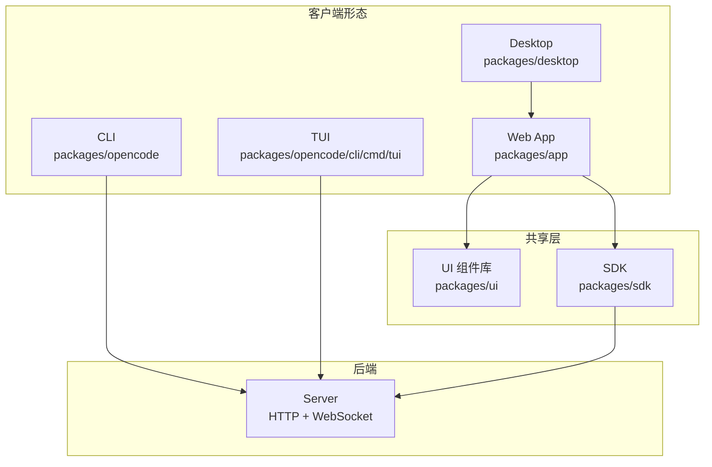
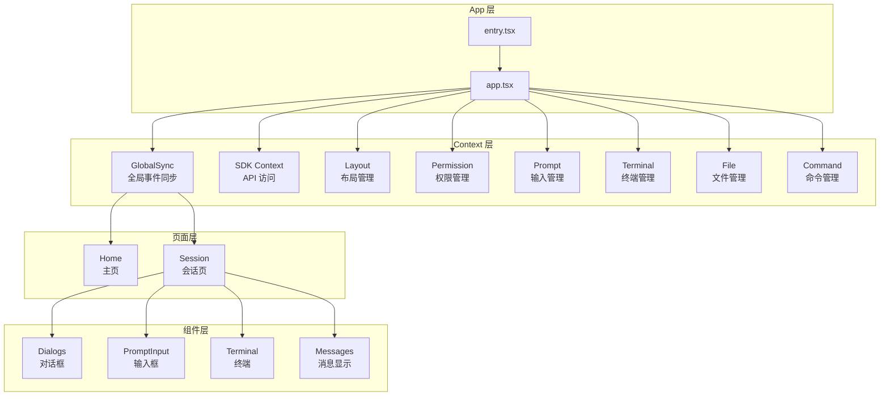
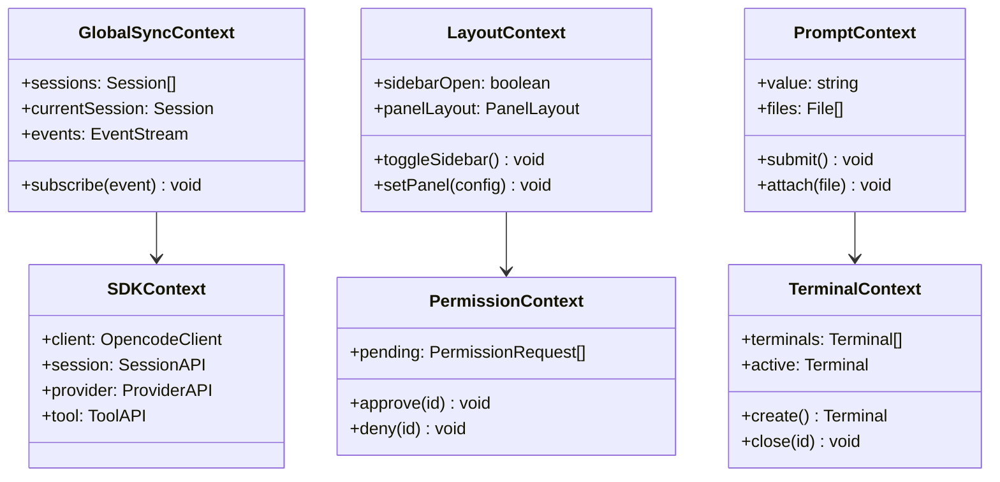
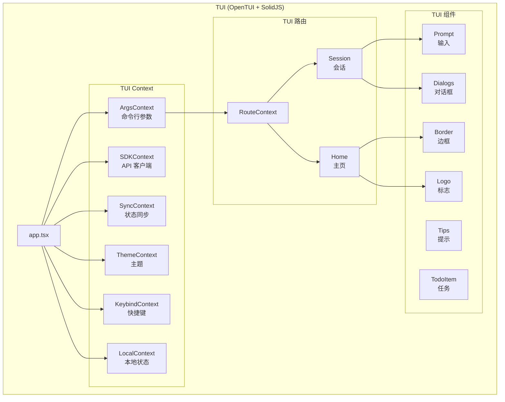
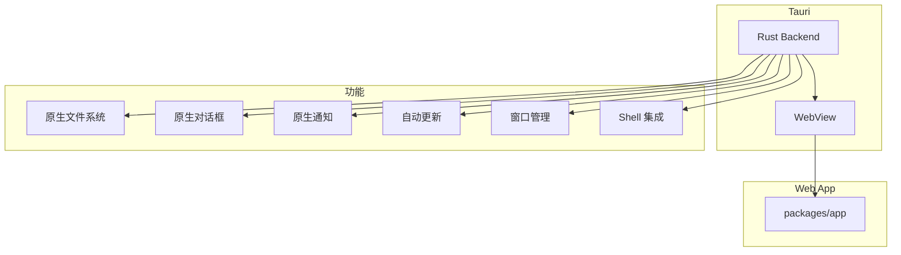
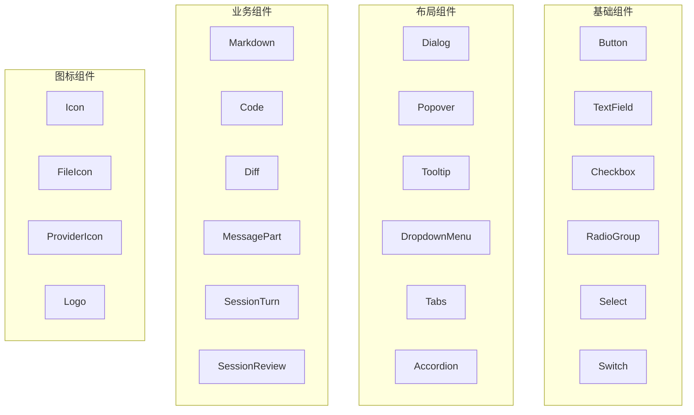
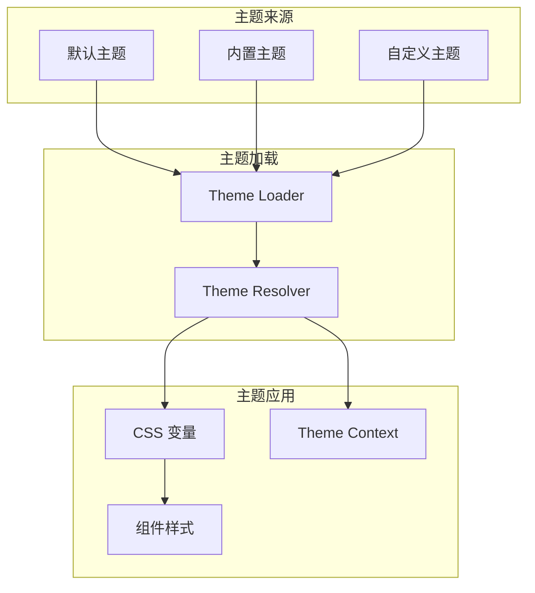
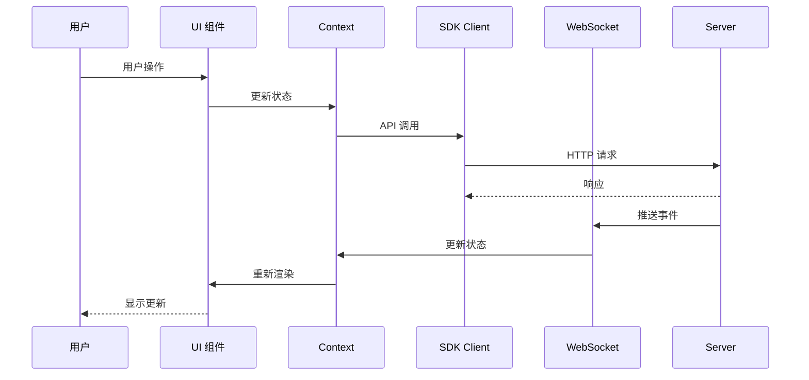
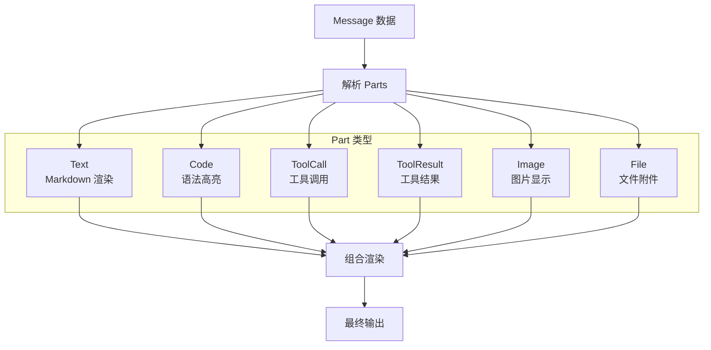

# UI 与客户端架构

## 1. 概述

OpenCode 提供多种客户端形态：CLI、TUI (终端界面)、Web App 和 Desktop App。它们共享核心 UI 组件库和 SDK，通过统一的后端服务进行通信。

## 2. 客户端类型



## 3. packages/app 结构

```
packages/app/src/
├── app.tsx              # 主应用组件
├── entry.tsx            # 入口点
├── index.ts             # 导出
├── components/          # 页面组件
│   ├── dialog-*.tsx     # 对话框组件
│   ├── prompt-input.tsx # 输入组件
│   ├── session/         # 会话组件
│   ├── terminal.tsx     # 终端组件
│   └── titlebar.tsx     # 标题栏
├── context/             # 全局状态
│   ├── global-sync.tsx  # 全局同步
│   ├── sdk.tsx          # SDK Context
│   ├── layout.tsx       # 布局
│   ├── permission.tsx   # 权限
│   ├── prompt.tsx       # 提示输入
│   ├── terminal.tsx     # 终端
│   └── ...
├── pages/               # 页面
│   ├── home.tsx         # 主页
│   ├── session.tsx      # 会话页
│   └── layout.tsx       # 布局
├── hooks/               # 自定义 Hooks
└── utils/               # 工具函数
```

## 4. packages/ui 结构

```
packages/ui/src/
├── components/          # UI 组件
│   ├── button.tsx       # 按钮
│   ├── dialog.tsx       # 对话框
│   ├── markdown.tsx     # Markdown 渲染
│   ├── diff.tsx         # Diff 显示
│   ├── code.tsx         # 代码高亮
│   ├── message-part.tsx # 消息部分
│   ├── session-turn.tsx # 会话轮次
│   └── ...
├── context/             # UI Context
│   ├── dialog.tsx       # 对话框上下文
│   ├── marked.tsx       # Markdown 上下文
│   ├── diff.tsx         # Diff 上下文
│   ├── code.tsx         # 代码上下文
│   └── worker-pool.tsx  # Worker 池
├── theme/               # 主题系统
│   ├── context.tsx      # 主题上下文
│   ├── color.ts         # 颜色定义
│   ├── default-themes.ts# 默认主题
│   └── types.ts         # 类型定义
├── pierre/              # Diff 渲染库
├── hooks/               # UI Hooks
└── assets/              # 静态资源
```

## 5. Web App 架构



## 6. Context 系统详解



## 7. TUI 架构



## 8. Desktop App 架构



## 9. 组件库架构



## 10. 主题系统



### 10.1 内置主题

- Catppuccin (默认)
- Catppuccin Frappe
- Catppuccin Macchiato
- Nord
- Dracula
- Gruvbox
- One Dark
- GitHub
- Monokai
- Material
- 更多...

## 11. 数据流



## 12. 消息渲染流程



## 13. 关键文件

### packages/app

| 文件 | 功能 |
|------|------|
| `app.tsx` | 主应用组件 |
| `context/global-sync.tsx` | 全局状态同步 |
| `context/sdk.tsx` | SDK Context |
| `pages/session.tsx` | 会话页面 |
| `components/prompt-input.tsx` | 输入组件 |

### packages/ui

| 文件 | 功能 |
|------|------|
| `components/markdown.tsx` | Markdown 渲染 |
| `components/diff.tsx` | Diff 显示 |
| `components/code.tsx` | 代码高亮 |
| `components/session-turn.tsx` | 会话轮次 |
| `theme/context.tsx` | 主题上下文 |

## 14. 相关文档

- [OpenCode 核心包架构](./02-opencode-core.md)
- [Console 后台管理系统](./07-console-system.md)
