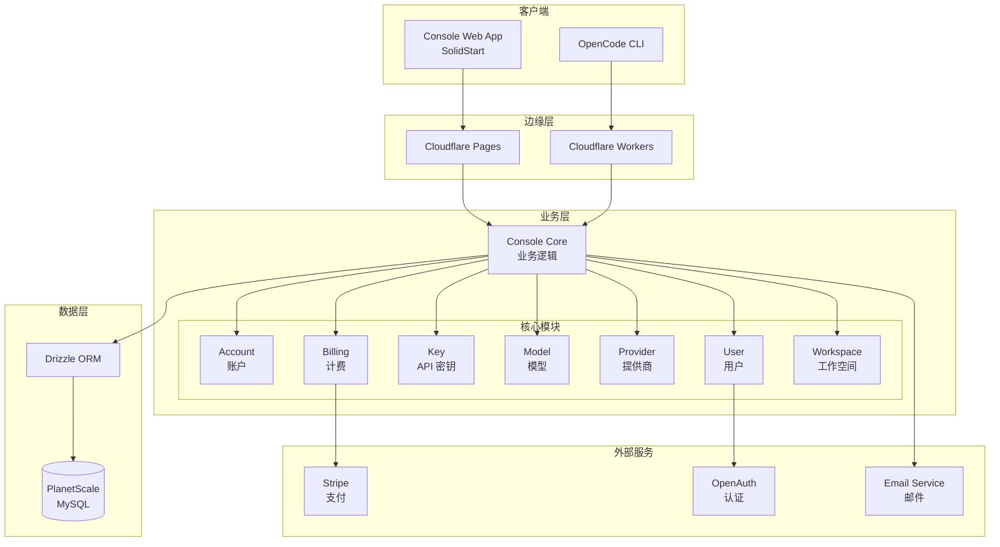
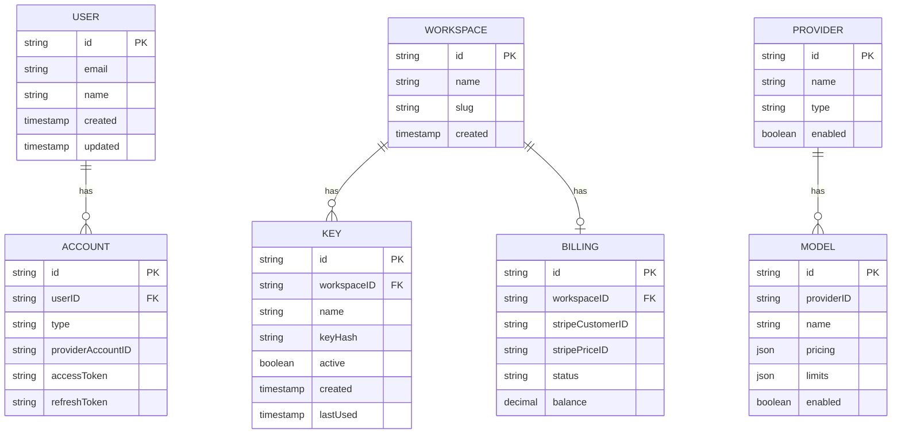
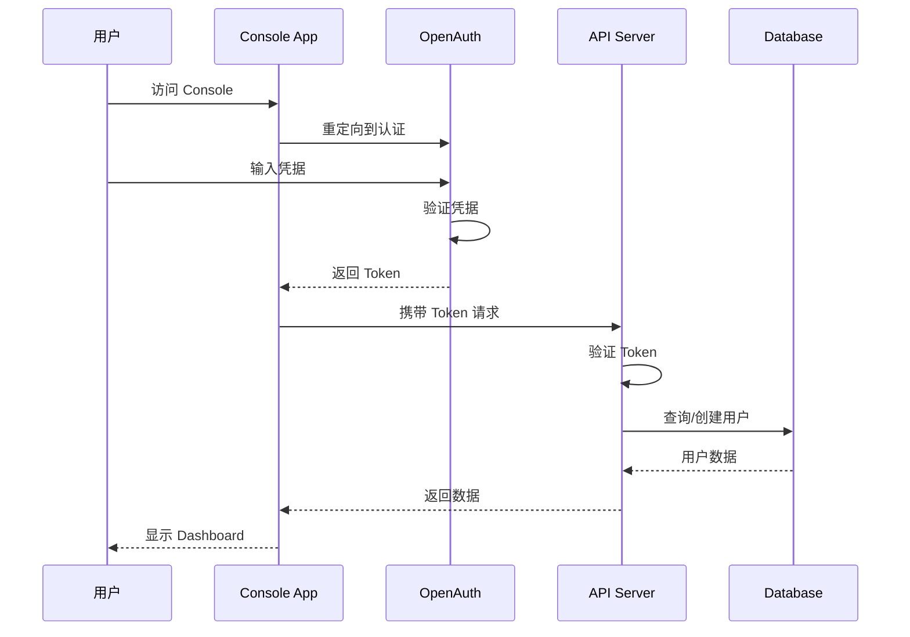
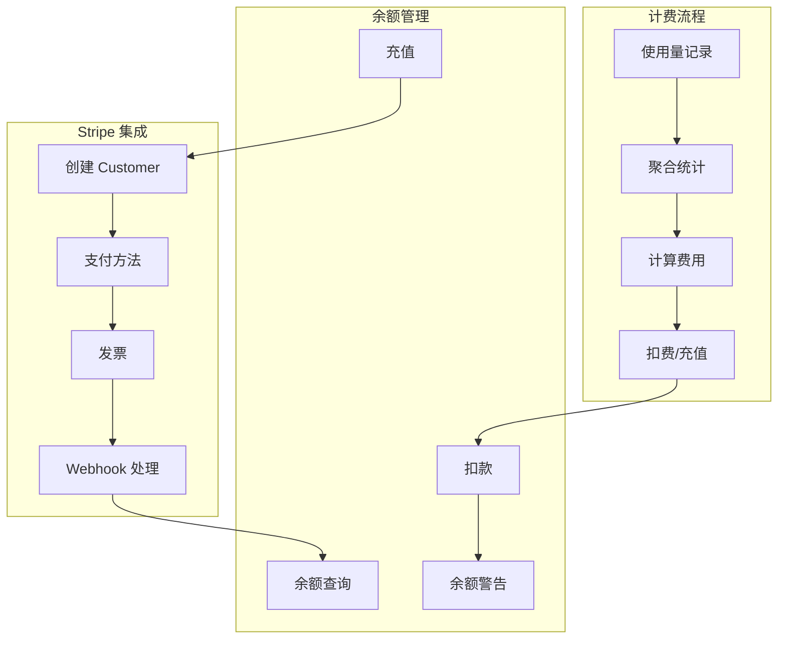
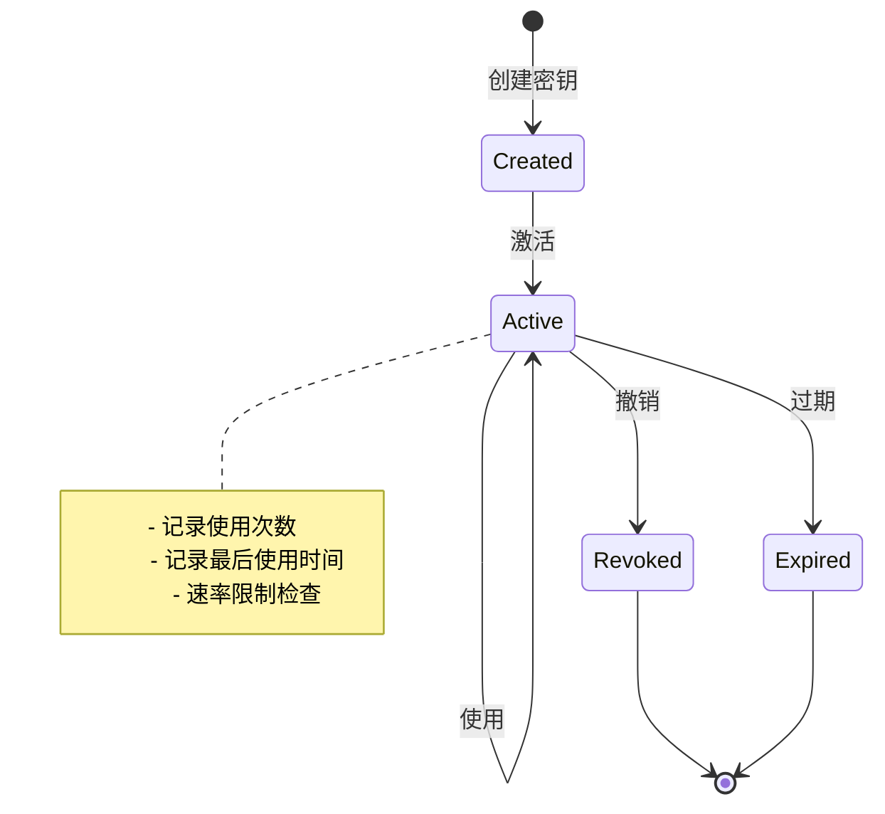
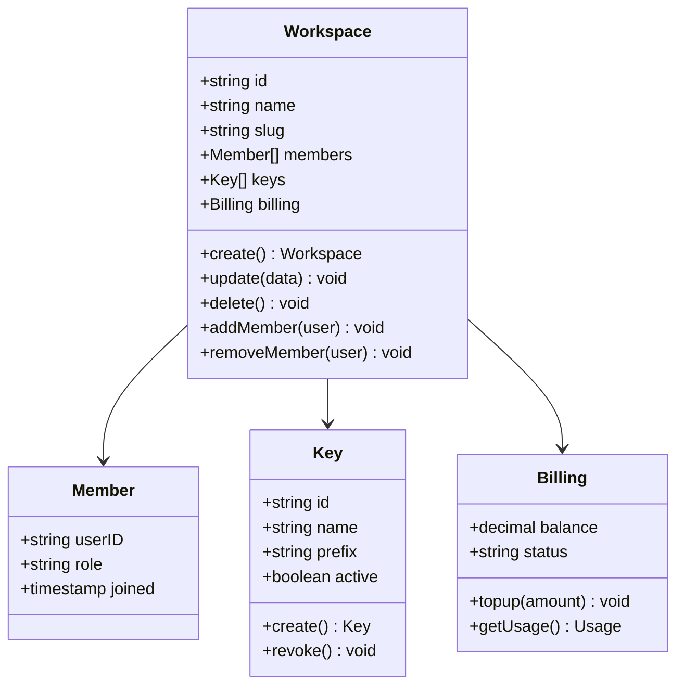
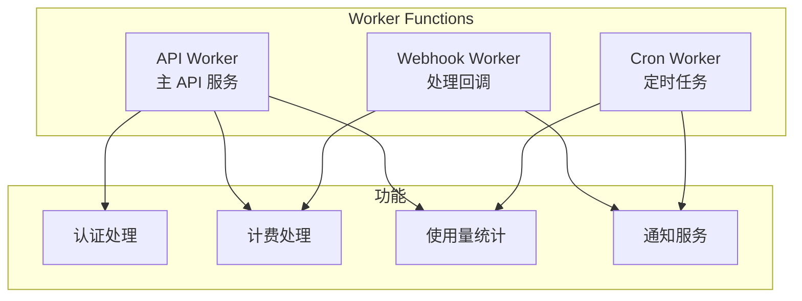
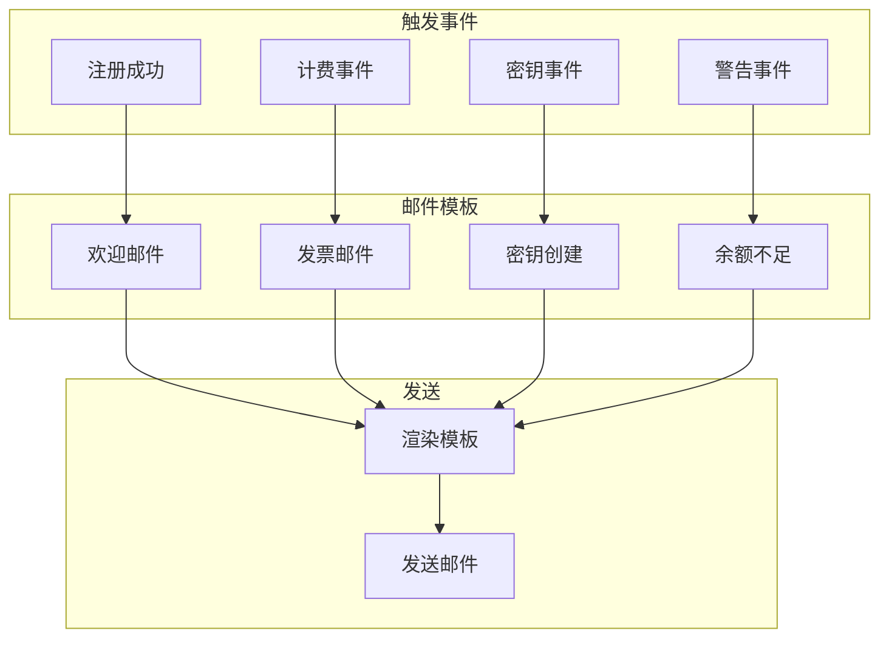
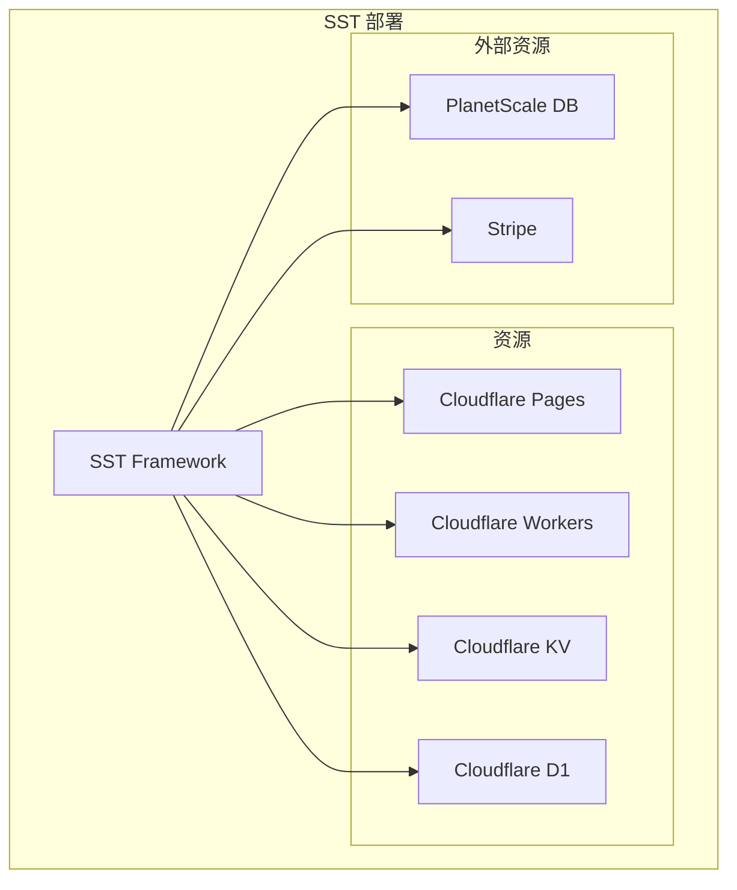

# Console 后台管理系统架构

## 1. 概述

Console 是 OpenCode 的云端管理控制台，提供用户认证、API 密钥管理、计费、模型配置等功能。它是一个完整的 SaaS 后台系统。

## 2. 目录结构

```
packages/console/
├── app/                 # SolidStart Web 应用
│   ├── src/
│   │   ├── app.tsx      # 主应用
│   │   ├── routes/      # 路由页面
│   │   ├── components/  # UI 组件
│   │   └── lib/         # 工具函数
├── core/                # 后端业务逻辑
│   ├── src/
│   │   ├── account.ts   # 账户管理
│   │   ├── billing.ts   # 计费系统
│   │   ├── key.ts       # API 密钥
│   │   ├── model.ts     # 模型管理
│   │   ├── provider.ts  # Provider 管理
│   │   ├── user.ts      # 用户管理
│   │   ├── workspace.ts # 工作空间
│   │   ├── schema/      # 数据库 Schema
│   │   └── drizzle/     # Drizzle ORM
├── function/            # Cloudflare Workers
│   └── src/
│       └── api/         # API 端点
├── mail/                # 邮件服务
│   └── src/
│       └── templates/   # 邮件模板
└── resource/            # CDK 资源定义
```

## 3. 系统架构图



## 4. 数据库 Schema



## 5. API 架构

```mermaid
flowchart TD
    subgraph "API 端点"
        AUTH_API[/auth/*<br/>认证]
        USER_API[/user/*<br/>用户]
        WORKSPACE_API[/workspace/*<br/>工作空间]
        KEY_API[/key/*<br/>API 密钥]
        BILLING_API[/billing/*<br/>计费]
        MODEL_API[/model/*<br/>模型]
        PROVIDER_API[/provider/*<br/>提供商]
    end

    subgraph "中间件"
        AUTH_MW[认证中间件]
        RATE_LIMIT[速率限制]
        CORS_MW[CORS]
        LOG_MW[日志]
    end

    REQUEST[请求] --> CORS_MW
    CORS_MW --> LOG_MW
    LOG_MW --> RATE_LIMIT
    RATE_LIMIT --> AUTH_MW

    AUTH_MW --> AUTH_API
    AUTH_MW --> USER_API
    AUTH_MW --> WORKSPACE_API
    AUTH_MW --> KEY_API
    AUTH_MW --> BILLING_API
    AUTH_MW --> MODEL_API
    AUTH_MW --> PROVIDER_API
```

## 6. 认证流程



## 7. 计费系统



## 8. API 密钥管理



## 9. 工作空间管理



## 10. Console Web App 路由

```mermaid
graph TB
    subgraph "公开路由"
        LOGIN[/login]
        SIGNUP[/signup]
        CALLBACK[/callback]
    end

    subgraph "受保护路由"
        DASHBOARD[/dashboard]
        WORKSPACE_PAGE[/workspace/:id]
        KEYS[/workspace/:id/keys]
        BILLING_PAGE[/workspace/:id/billing]
        SETTINGS[/settings]
        MODELS_PAGE[/models]
    end

    subgraph "管理员路由"
        ADMIN[/admin]
        ADMIN_USERS[/admin/users]
        ADMIN_PROVIDERS[/admin/providers]
        ADMIN_MODELS[/admin/models]
    end

    LOGIN --> DASHBOARD
    SIGNUP --> DASHBOARD
    CALLBACK --> DASHBOARD

    DASHBOARD --> WORKSPACE_PAGE
    WORKSPACE_PAGE --> KEYS
    WORKSPACE_PAGE --> BILLING_PAGE
    DASHBOARD --> SETTINGS
    DASHBOARD --> MODELS_PAGE
```

## 11. Cloudflare Workers 函数



## 12. 邮件系统



## 13. 基础设施配置



## 14. 关键文件

### core 模块

| 文件 | 功能 |
|------|------|
| `account.ts` | 账户管理 |
| `billing.ts` | 计费系统 |
| `key.ts` | API 密钥管理 |
| `model.ts` | 模型配置 |
| `provider.ts` | Provider 管理 |
| `user.ts` | 用户管理 |
| `workspace.ts` | 工作空间管理 |
| `schema/*.sql.ts` | 数据库 Schema |

### app 模块

| 文件 | 功能 |
|------|------|
| `app.tsx` | 主应用 |
| `routes/` | 页面路由 |
| `components/` | UI 组件 |
| `lib/` | 工具函数 |

## 15. 相关文档

- [UI 与客户端架构](./06-ui-client.md)
- [Provider 系统](./05-provider-system.md)
