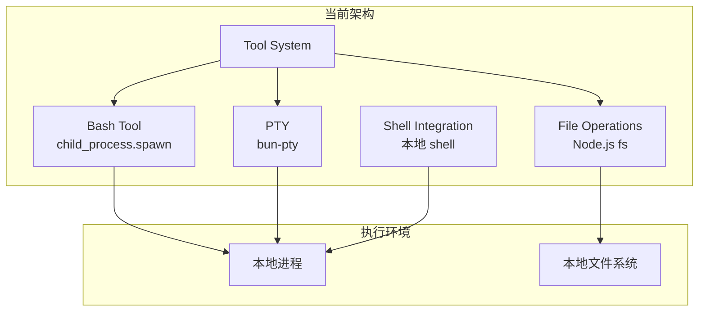
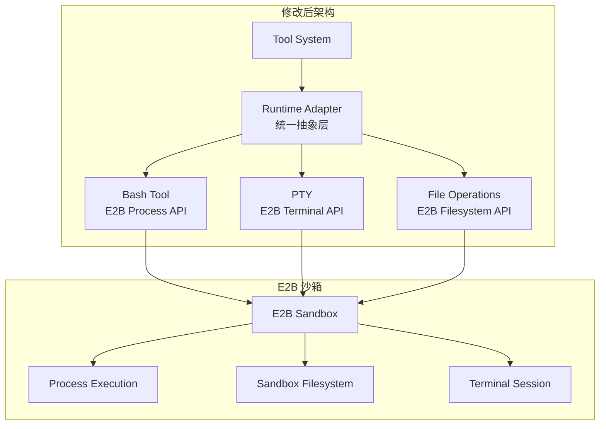
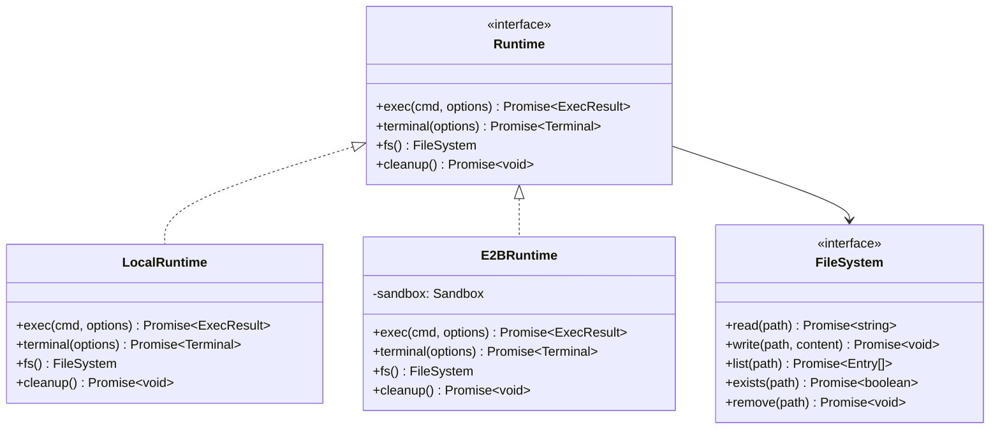
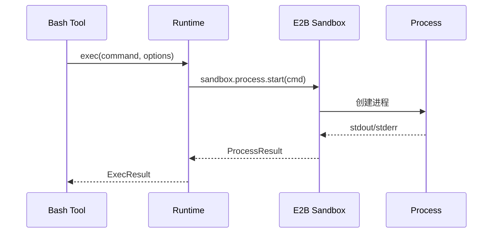
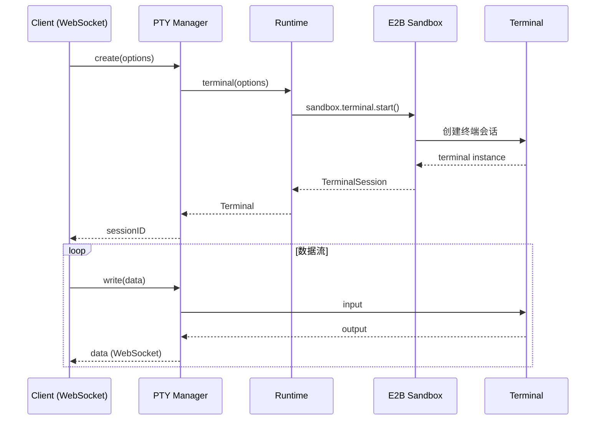
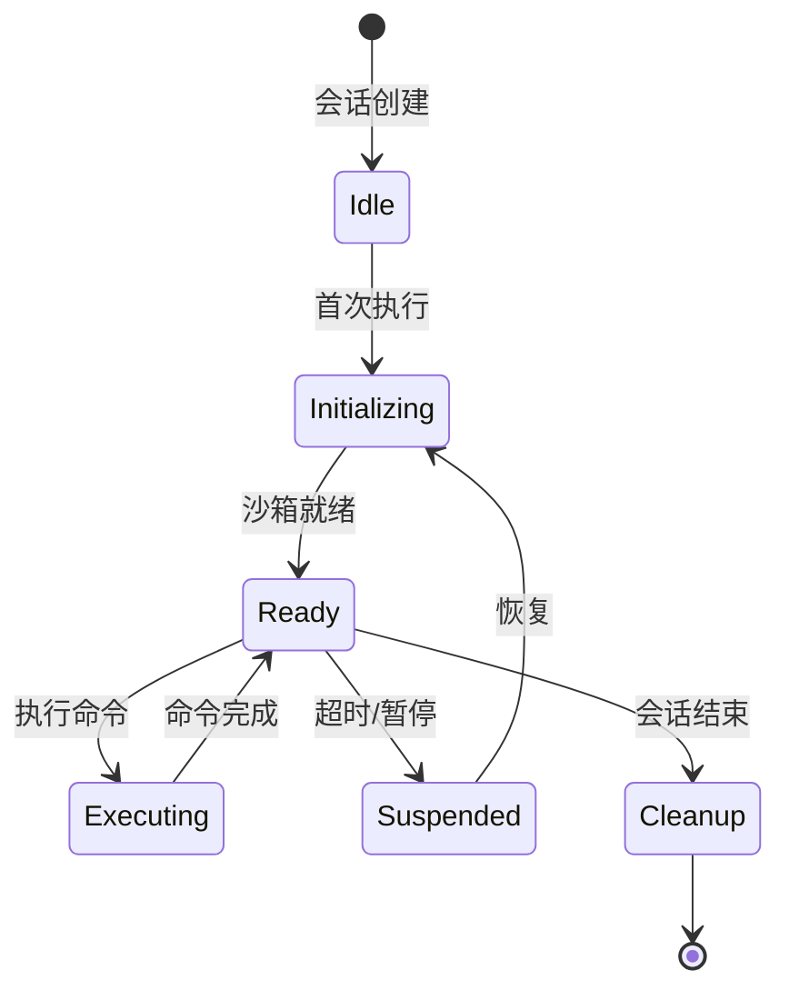
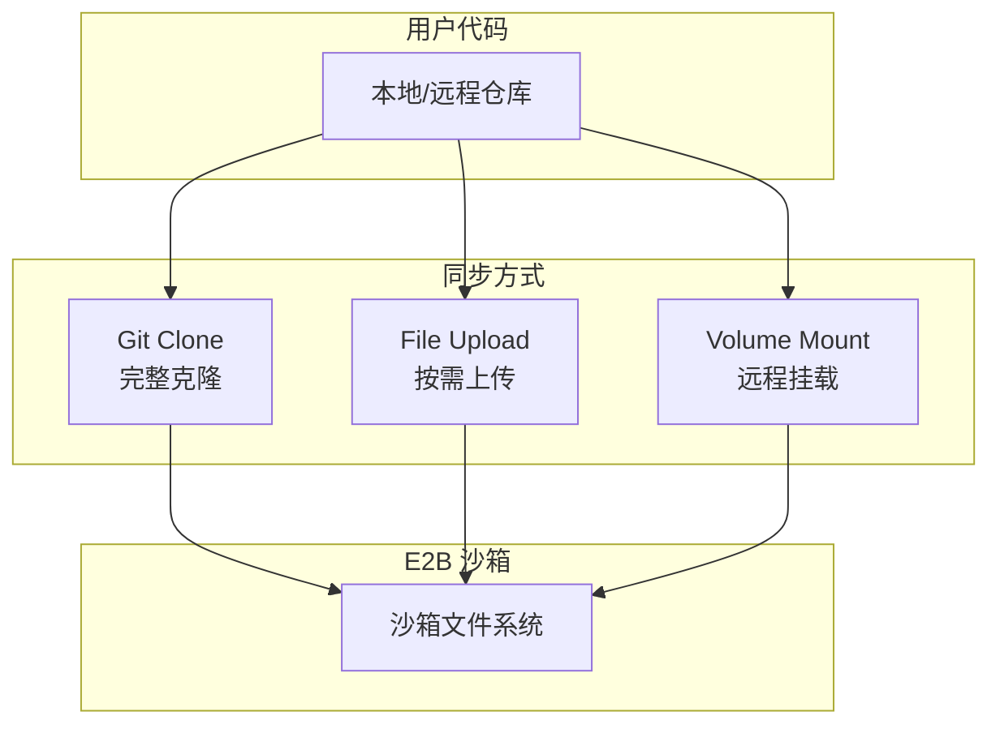
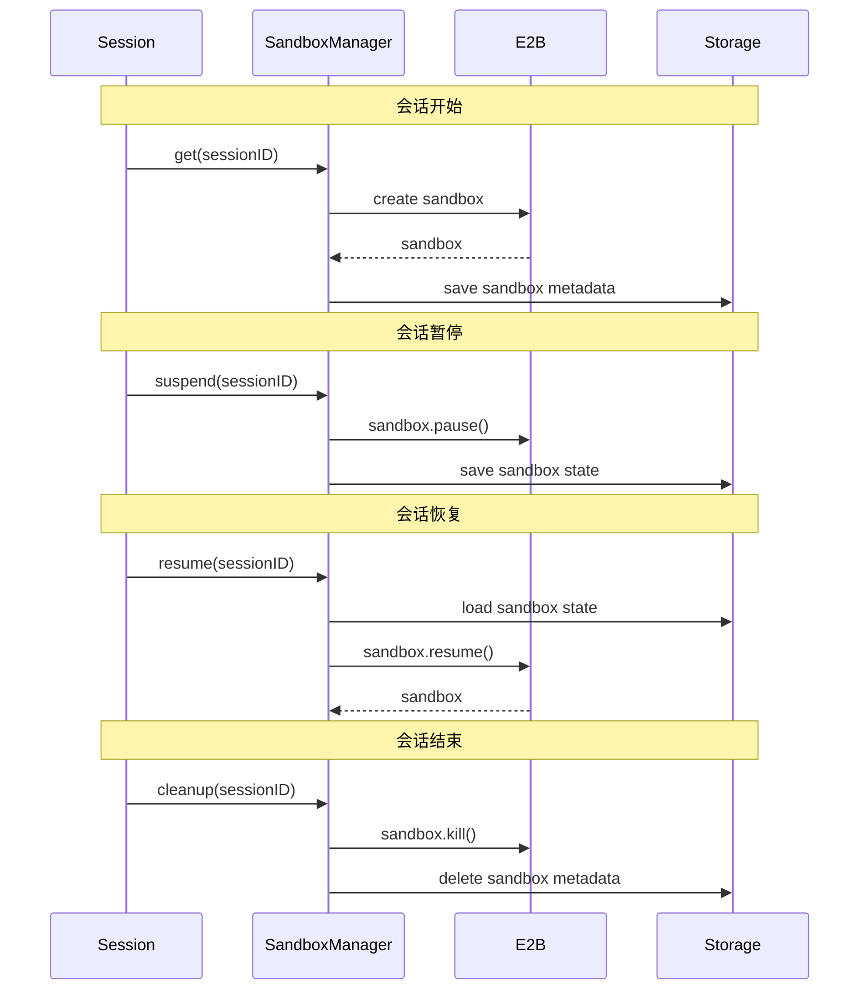
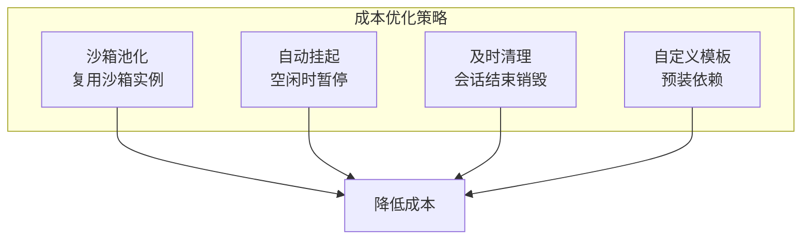

# OpenCode E2B 云端部署集成指南

## 1. 概述

将 OpenCode 部署到云端并使用 [E2B](https://e2b.dev) 作为运行时，需要将本地代码执行替换为 E2B 沙箱执行。本文档详细说明需要修改的部分。

## 2. 当前代码执行架构



## 3. E2B 集成后架构



## 4. 需要修改的核心文件

### 4.1 优先级分类

| 优先级 | 文件 | 修改内容 |
|--------|------|----------|
| **P0** | `tool/bash.ts` | 替换 spawn 为 E2B 进程执行 |
| **P0** | `pty/index.ts` | 替换 bun-pty 为 E2B 终端 |
| **P0** | `file/index.ts` | 替换本地 fs 为 E2B 文件系统 |
| **P1** | `shell/shell.ts` | 适配 E2B 沙箱 shell |
| **P1** | `project/instance.ts` | 修改路径边界检查 |
| **P2** | `tool/edit.ts` | 使用 E2B 文件 API |
| **P2** | `tool/read.ts` | 使用 E2B 文件 API |
| **P2** | `tool/write.ts` | 使用 E2B 文件 API |
| **P2** | `tool/glob.ts` | 使用 E2B 文件列表 |
| **P2** | `tool/grep.ts` | 使用 E2B 进程执行 |

## 5. 详细修改方案

### 5.1 创建 Runtime 抽象层

建议创建一个新的运行时抽象层来统一管理执行环境：

```
packages/opencode/src/runtime/
├── index.ts           # Runtime 接口定义
├── local.ts           # 本地运行时实现
├── e2b.ts             # E2B 运行时实现
└── sandbox.ts         # 沙箱管理
```



### 5.2 Bash Tool 修改

**当前代码** (`tool/bash.ts:157-231`):
```typescript
// 当前使用 child_process.spawn
const proc = spawn(input.command, [], {
  cwd: workdir,
  env: { ...process.env },
  shell: true,
  detached: !Flag.isWindows,
  stdio: ["ignore", "pipe", "pipe"],
})
```

**E2B 集成后**:
```typescript
// 使用 Runtime 抽象
const runtime = await Runtime.get(ctx.sessionID)
const result = await runtime.exec(input.command, {
  cwd: workdir,
  timeout: input.timeout,
  env: input.env,
  signal: ctx.abort,
})
```



### 5.3 PTY 修改

**当前代码** (`pty/index.ts:96-130`):
```typescript
// 当前使用 bun-pty
const spawn = await import("bun-pty").then((m) => m.spawn)
const ptyProcess = spawn(shell, shellArgs, {
  cwd: input.cwd || Instance.directory,
  env: { ...process.env, ...input.env, TERM: "xterm-256color" },
})
```

**E2B 集成后**:
```typescript
// 使用 E2B Terminal API
const runtime = await Runtime.get(sessionID)
const terminal = await runtime.terminal({
  cwd: input.cwd,
  env: input.env,
  cols: input.cols,
  rows: input.rows,
})
```



### 5.4 文件系统修改

**当前代码** (`file/index.ts`):
```typescript
// 当前使用 Node.js fs
import fs from "fs/promises"
const content = await fs.readFile(path, "utf-8")
await fs.writeFile(path, content)
```

**E2B 集成后**:
```typescript
// 使用 Runtime FileSystem
const runtime = await Runtime.get(sessionID)
const fs = runtime.fs()
const content = await fs.read(path)
await fs.write(path, content)
```

## 6. E2B Runtime 实现示例

```typescript
// packages/opencode/src/runtime/e2b.ts
import { Sandbox } from "@e2b/code-interpreter"

export class E2BRuntime implements Runtime {
  private sandbox: Sandbox | null = null
  private sessionID: string

  constructor(sessionID: string) {
    this.sessionID = sessionID
  }

  async init(options: E2BOptions): Promise<void> {
    this.sandbox = await Sandbox.create({
      template: options.template || "base",
      timeout: options.timeout || 300_000, // 5 minutes
      metadata: { sessionID: this.sessionID },
    })
  }

  async exec(command: string, options: ExecOptions): Promise<ExecResult> {
    if (!this.sandbox) throw new Error("Sandbox not initialized")

    const proc = await this.sandbox.process.start({
      cmd: command,
      cwd: options.cwd,
      env: options.env,
      timeout: options.timeout,
    })

    // 收集输出
    let stdout = ""
    let stderr = ""

    proc.stdout.on("data", (data) => { stdout += data })
    proc.stderr.on("data", (data) => { stderr += data })

    const result = await proc.wait()

    return {
      stdout,
      stderr,
      exitCode: result.exitCode,
    }
  }

  async terminal(options: TerminalOptions): Promise<Terminal> {
    if (!this.sandbox) throw new Error("Sandbox not initialized")

    const term = await this.sandbox.terminal.start({
      cwd: options.cwd,
      cols: options.cols || 80,
      rows: options.rows || 24,
      env: options.env,
    })

    return new E2BTerminal(term)
  }

  fs(): FileSystem {
    if (!this.sandbox) throw new Error("Sandbox not initialized")
    return new E2BFileSystem(this.sandbox.filesystem)
  }

  async cleanup(): Promise<void> {
    if (this.sandbox) {
      await this.sandbox.kill()
      this.sandbox = null
    }
  }
}

class E2BFileSystem implements FileSystem {
  constructor(private fs: SandboxFilesystem) {}

  async read(path: string): Promise<string> {
    return this.fs.read(path)
  }

  async write(path: string, content: string): Promise<void> {
    await this.fs.write(path, content)
  }

  async list(path: string): Promise<Entry[]> {
    return this.fs.list(path)
  }

  async exists(path: string): Promise<boolean> {
    try {
      await this.fs.read(path)
      return true
    } catch {
      return false
    }
  }

  async remove(path: string): Promise<void> {
    await this.fs.remove(path)
  }
}
```

## 7. 沙箱生命周期管理



```typescript
// packages/opencode/src/runtime/sandbox.ts
export class SandboxManager {
  private sandboxes = new Map<string, E2BRuntime>()
  private timeouts = new Map<string, NodeJS.Timeout>()

  async get(sessionID: string): Promise<Runtime> {
    let runtime = this.sandboxes.get(sessionID)

    if (!runtime) {
      runtime = new E2BRuntime(sessionID)
      await runtime.init({
        template: "base",
        timeout: 300_000,
      })
      this.sandboxes.set(sessionID, runtime)
    }

    // 重置超时
    this.resetTimeout(sessionID)
    return runtime
  }

  private resetTimeout(sessionID: string) {
    const existing = this.timeouts.get(sessionID)
    if (existing) clearTimeout(existing)

    // 5 分钟无活动后清理
    const timeout = setTimeout(() => {
      this.cleanup(sessionID)
    }, 5 * 60 * 1000)

    this.timeouts.set(sessionID, timeout)
  }

  async cleanup(sessionID: string): Promise<void> {
    const runtime = this.sandboxes.get(sessionID)
    if (runtime) {
      await runtime.cleanup()
      this.sandboxes.delete(sessionID)
    }
    const timeout = this.timeouts.get(sessionID)
    if (timeout) {
      clearTimeout(timeout)
      this.timeouts.delete(sessionID)
    }
  }
}
```

## 8. 配置选项

```typescript
// .opencode/config.json
{
  "runtime": {
    "type": "e2b",  // "local" | "e2b"
    "e2b": {
      "apiKey": "${E2B_API_KEY}",
      "template": "base",
      "timeout": 300000,
      "keepAlive": true,
      "resources": {
        "cpu": 2,
        "memory": "4GB"
      }
    }
  }
}
```

## 9. 代码同步策略



### 推荐方案：Git Clone + 增量同步

```typescript
async function syncCodeToSandbox(
  sandbox: Sandbox,
  repoUrl: string,
  branch: string
): Promise<void> {
  // 1. 克隆仓库
  await sandbox.process.start({
    cmd: `git clone --depth 1 --branch ${branch} ${repoUrl} /workspace`,
  }).wait()

  // 2. 安装依赖
  await sandbox.process.start({
    cmd: "cd /workspace && npm install",
  }).wait()
}

async function syncChanges(
  sandbox: Sandbox,
  changes: FileChange[]
): Promise<void> {
  for (const change of changes) {
    if (change.type === "modify" || change.type === "create") {
      await sandbox.filesystem.write(change.path, change.content)
    } else if (change.type === "delete") {
      await sandbox.filesystem.remove(change.path)
    }
  }
}
```

## 10. 会话状态持久化



## 11. 安全考虑

### 11.1 资源限制

```typescript
const sandboxConfig = {
  // CPU 限制
  cpu: 2,
  // 内存限制
  memory: "4GB",
  // 磁盘限制
  disk: "10GB",
  // 网络限制
  network: {
    allowOutbound: true,
    allowedHosts: ["github.com", "npm.org"],
  },
  // 超时
  timeout: 300_000,
}
```

### 11.2 环境变量过滤

```typescript
function filterEnvVars(env: Record<string, string>): Record<string, string> {
  const ALLOWED_PREFIXES = ["NODE_", "NPM_", "PATH", "HOME", "USER"]
  const BLOCKED = ["AWS_", "OPENAI_API_KEY", "ANTHROPIC_API_KEY"]

  return Object.fromEntries(
    Object.entries(env).filter(([key]) => {
      if (BLOCKED.some(b => key.startsWith(b))) return false
      if (ALLOWED_PREFIXES.some(p => key.startsWith(p))) return true
      return false
    })
  )
}
```

## 12. 成本优化



## 13. 总结

### 需要新增的文件

```
packages/opencode/src/runtime/
├── index.ts           # Runtime 接口
├── local.ts           # 本地实现
├── e2b.ts             # E2B 实现
├── sandbox.ts         # 沙箱管理
└── sync.ts            # 代码同步
```

### 需要修改的文件

| 文件 | 修改点 |
|------|--------|
| `tool/bash.ts` | 使用 Runtime.exec() |
| `pty/index.ts` | 使用 Runtime.terminal() |
| `file/index.ts` | 使用 Runtime.fs() |
| `tool/edit.ts` | 使用 Runtime.fs() |
| `tool/read.ts` | 使用 Runtime.fs() |
| `tool/write.ts` | 使用 Runtime.fs() |
| `tool/glob.ts` | 使用 Runtime.fs() |
| `tool/grep.ts` | 使用 Runtime.exec() |
| `project/instance.ts` | 适配沙箱路径 |
| `config/config.ts` | 添加 runtime 配置 |

### 实现优先级

1. **Phase 1**: 创建 Runtime 抽象层
2. **Phase 2**: 实现 E2B Runtime
3. **Phase 3**: 修改 Bash/PTY 工具
4. **Phase 4**: 修改文件操作工具
5. **Phase 5**: 添加沙箱管理和代码同步
6. **Phase 6**: 优化和测试
