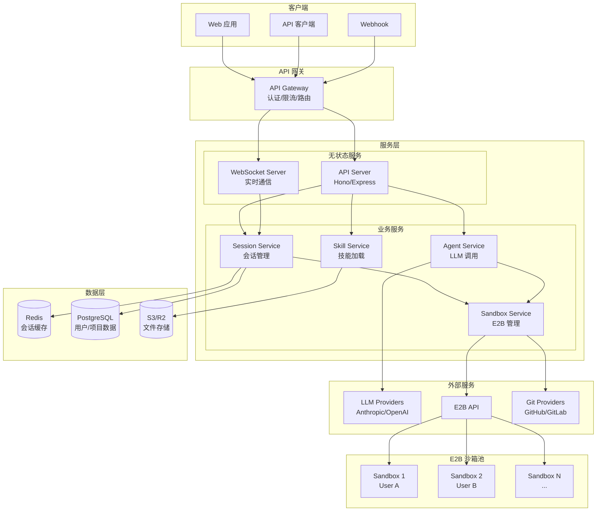
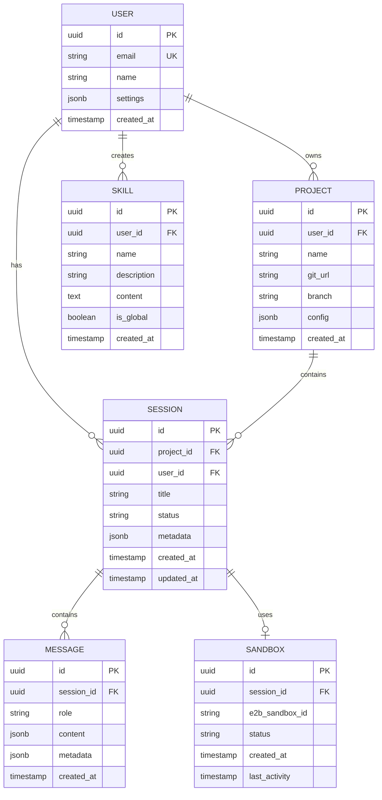
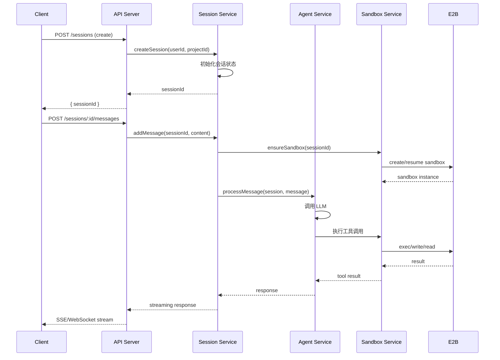
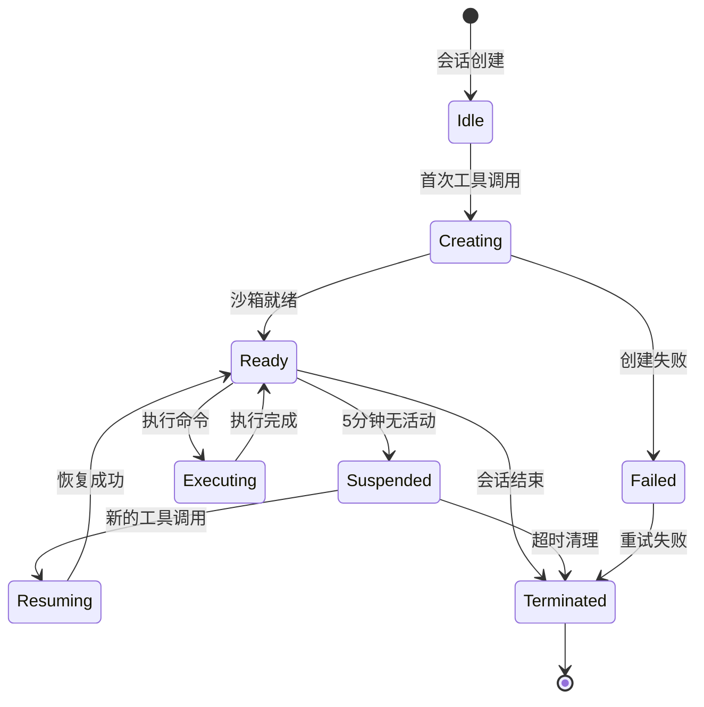
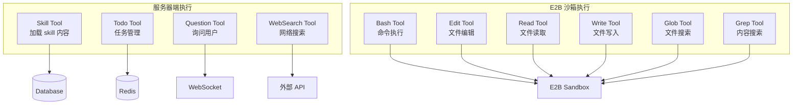
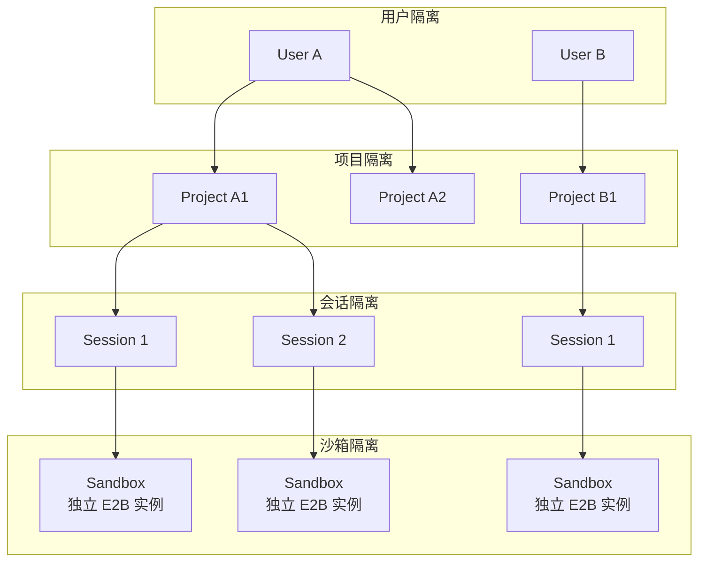
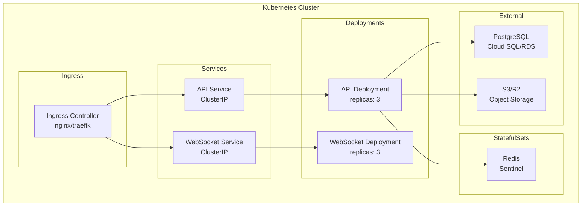
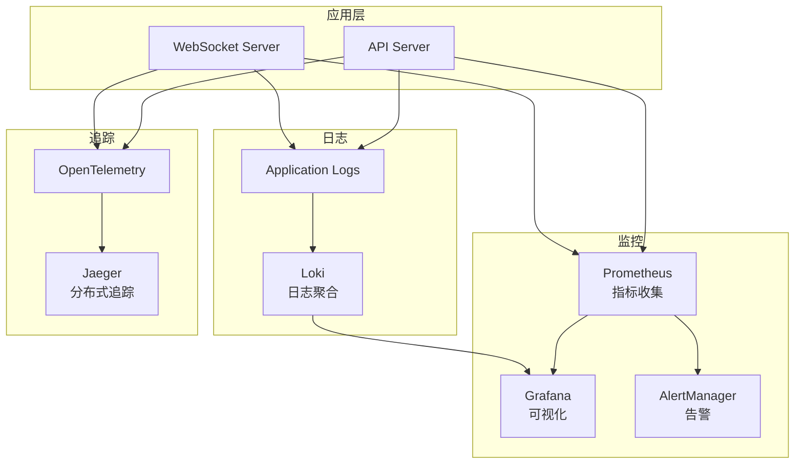

# OpenCode 云端多用户部署架构指南

## 1. 项目概述

本文档描述如何基于 OpenCode 开发一个云端多用户 AI 编程助手服务，类似 Manus。

### 1.1 目标特性

- **纯 API 服务** - 无终端/客户端，通过 HTTP/WebSocket 提供服务
- **多用户隔离** - 每个用户独立的会话、项目和执行环境
- **E2B 沙箱执行** - 代码在 E2B 云端沙箱中安全执行
- **Skill 支持** - 可加载和使用 skill 模板
- **可扩展** - 支持水平扩展

### 1.2 执行位置划分

| 组件 | 执行位置 | 原因 |
|------|----------|------|
| **Skill 加载** | 服务器 | Skill 是纯文本模板，无需沙箱 |
| **Agent/LLM 调用** | 服务器 | 需要访问 API Key 和配置 |
| **Session 管理** | 服务器 | 状态管理和持久化 |
| **Bash 执行** | E2B 沙箱 | 安全隔离的代码执行 |
| **文件操作** | E2B 沙箱 | 用户代码文件在沙箱中 |
| **Git 操作** | E2B 沙箱 | 需要访问用户代码仓库 |

## 2. 整体架构



## 3. 核心组件设计

### 3.1 项目结构

```
opencode-cloud/
├── packages/
│   ├── api/                    # API 服务
│   │   ├── src/
│   │   │   ├── routes/         # API 路由
│   │   │   ├── middleware/     # 中间件
│   │   │   ├── services/       # 业务服务
│   │   │   └── index.ts
│   │   └── package.json
│   │
│   ├── core/                   # 核心逻辑 (从 opencode 提取)
│   │   ├── src/
│   │   │   ├── agent/          # Agent 系统
│   │   │   ├── session/        # 会话管理
│   │   │   ├── skill/          # Skill 系统
│   │   │   ├── tool/           # 工具定义
│   │   │   ├── provider/       # LLM Provider
│   │   │   └── permission/     # 权限系统
│   │   └── package.json
│   │
│   ├── runtime/                # 运行时抽象
│   │   ├── src/
│   │   │   ├── interface.ts    # Runtime 接口
│   │   │   ├── e2b.ts          # E2B 实现
│   │   │   ├── sandbox.ts      # 沙箱管理
│   │   │   └── sync.ts         # 代码同步
│   │   └── package.json
│   │
│   ├── storage/                # 存储抽象
│   │   ├── src/
│   │   │   ├── interface.ts    # Storage 接口
│   │   │   ├── postgres.ts     # PostgreSQL
│   │   │   ├── redis.ts        # Redis
│   │   │   └── s3.ts           # S3/R2
│   │   └── package.json
│   │
│   └── shared/                 # 共享类型和工具
│       ├── src/
│       │   ├── types/
│       │   └── utils/
│       └── package.json
│
├── infra/                      # 基础设施
│   ├── terraform/
│   └── docker/
│
└── package.json
```

### 3.2 数据模型



## 4. 服务详细设计

### 4.1 API Server

```typescript
// packages/api/src/index.ts
import { Hono } from "hono"
import { cors } from "hono/cors"
import { jwt } from "hono/jwt"

const app = new Hono()

// 中间件
app.use("*", cors())
app.use("/api/*", jwt({ secret: process.env.JWT_SECRET }))

// 路由
app.route("/api/auth", authRoutes)
app.route("/api/projects", projectRoutes)
app.route("/api/sessions", sessionRoutes)
app.route("/api/skills", skillRoutes)

// WebSocket 升级
app.get("/ws", upgradeWebSocket(handleWebSocket))

export default app
```

### 4.2 Session Service



```typescript
// packages/api/src/services/session.ts
export class SessionService {
  constructor(
    private db: Database,
    private redis: Redis,
    private agentService: AgentService,
    private sandboxService: SandboxService
  ) {}

  async create(userId: string, projectId: string): Promise<Session> {
    const session = await this.db.session.create({
      userId,
      projectId,
      status: "active",
    })

    // 缓存会话状态
    await this.redis.set(`session:${session.id}`, JSON.stringify(session))

    return session
  }

  async processMessage(
    sessionId: string,
    content: string,
    onStream: (chunk: StreamChunk) => void
  ): Promise<void> {
    const session = await this.getSession(sessionId)

    // 确保沙箱就绪
    const sandbox = await this.sandboxService.ensure(sessionId, session.projectId)

    // 创建运行时上下文
    const runtime = new E2BRuntime(sandbox)

    // 处理消息
    await this.agentService.process({
      session,
      content,
      runtime,
      onStream,
    })
  }
}
```

### 4.3 Agent Service (LLM 调用)

```typescript
// packages/api/src/services/agent.ts
export class AgentService {
  constructor(
    private providerService: ProviderService,
    private skillService: SkillService,
    private toolRegistry: ToolRegistry
  ) {}

  async process(input: {
    session: Session
    content: string
    runtime: Runtime
    onStream: (chunk: StreamChunk) => void
  }): Promise<void> {
    const { session, content, runtime, onStream } = input

    // 获取 Agent 配置
    const agent = await this.getAgent(session)

    // 获取可用 Skills
    const skills = await this.skillService.getForUser(session.userId)

    // 构建系统提示
    const systemPrompt = this.buildSystemPrompt(agent, skills)

    // 获取工具列表 (使用 runtime)
    const tools = await this.toolRegistry.getTools(agent, runtime)

    // 获取 LLM Provider
    const model = await this.providerService.getModel(agent.model)

    // 执行对话循环
    await this.conversationLoop({
      model,
      systemPrompt,
      tools,
      messages: await this.getMessages(session.id),
      userMessage: content,
      onStream,
    })
  }

  private async conversationLoop(input: ConversationInput): Promise<void> {
    const { model, tools, onStream } = input

    while (true) {
      const response = await model.generate({
        messages: input.messages,
        tools,
        stream: true,
      })

      for await (const chunk of response) {
        onStream(chunk)

        if (chunk.type === "tool_call") {
          // 执行工具
          const result = await this.executeTool(chunk.tool, chunk.args)
          input.messages.push({ role: "tool", content: result })
        }
      }

      // 检查是否完成
      if (!response.hasToolCalls) break
    }
  }
}
```

### 4.4 Skill Service

```typescript
// packages/api/src/services/skill.ts
export class SkillService {
  constructor(
    private db: Database,
    private storage: S3Storage
  ) {}

  // Skill 在服务器端加载，不在 E2B 中
  async getForUser(userId: string): Promise<Skill[]> {
    // 获取用户自定义 skills
    const userSkills = await this.db.skill.findMany({
      where: { userId },
    })

    // 获取全局 skills
    const globalSkills = await this.db.skill.findMany({
      where: { isGlobal: true },
    })

    return [...userSkills, ...globalSkills]
  }

  async load(skillId: string): Promise<SkillContent> {
    const skill = await this.db.skill.findUnique({ where: { id: skillId } })

    // 从 S3 加载 skill 内容
    const content = await this.storage.get(`skills/${skill.id}/SKILL.md`)

    return {
      ...skill,
      content: this.parseSkillContent(content),
    }
  }

  async create(userId: string, input: CreateSkillInput): Promise<Skill> {
    const skill = await this.db.skill.create({
      data: {
        userId,
        name: input.name,
        description: input.description,
      },
    })

    // 上传 skill 内容到 S3
    await this.storage.put(`skills/${skill.id}/SKILL.md`, input.content)

    return skill
  }
}
```

### 4.5 Sandbox Service (E2B 管理)



```typescript
// packages/runtime/src/sandbox.ts
export class SandboxService {
  private sandboxes = new Map<string, SandboxState>()

  constructor(
    private db: Database,
    private redis: Redis
  ) {
    // 启动清理任务
    this.startCleanupJob()
  }

  async ensure(sessionId: string, projectId: string): Promise<E2BSandbox> {
    let state = this.sandboxes.get(sessionId)

    if (!state) {
      // 检查数据库中是否有暂停的沙箱
      const existing = await this.db.sandbox.findUnique({
        where: { sessionId },
      })

      if (existing?.status === "suspended") {
        state = await this.resume(existing)
      } else {
        state = await this.create(sessionId, projectId)
      }

      this.sandboxes.set(sessionId, state)
    }

    // 更新最后活动时间
    state.lastActivity = Date.now()
    await this.redis.set(`sandbox:${sessionId}:activity`, Date.now())

    return state.sandbox
  }

  private async create(
    sessionId: string,
    projectId: string
  ): Promise<SandboxState> {
    const project = await this.db.project.findUnique({
      where: { id: projectId },
    })

    // 创建 E2B 沙箱
    const sandbox = await Sandbox.create({
      template: "opencode-base",
      timeout: 300_000,
      metadata: { sessionId, projectId },
    })

    // 同步代码到沙箱
    if (project.gitUrl) {
      await this.syncCode(sandbox, project)
    }

    // 记录到数据库
    await this.db.sandbox.create({
      data: {
        sessionId,
        e2bSandboxId: sandbox.id,
        status: "active",
      },
    })

    return {
      sandbox,
      sessionId,
      lastActivity: Date.now(),
    }
  }

  private async syncCode(sandbox: E2BSandbox, project: Project): Promise<void> {
    // Git clone
    await sandbox.process.start({
      cmd: `git clone --depth 1 --branch ${project.branch} ${project.gitUrl} /workspace`,
    }).wait()

    // 安装依赖
    await sandbox.process.start({
      cmd: "cd /workspace && npm install",
      timeout: 120_000,
    }).wait()
  }

  private startCleanupJob(): void {
    setInterval(async () => {
      const now = Date.now()
      const timeout = 5 * 60 * 1000 // 5 minutes

      for (const [sessionId, state] of this.sandboxes) {
        if (now - state.lastActivity > timeout) {
          await this.suspend(sessionId)
        }
      }
    }, 60_000) // 每分钟检查
  }

  async suspend(sessionId: string): Promise<void> {
    const state = this.sandboxes.get(sessionId)
    if (!state) return

    // E2B 沙箱暂停
    await state.sandbox.pause()

    // 更新数据库状态
    await this.db.sandbox.update({
      where: { sessionId },
      data: { status: "suspended" },
    })

    this.sandboxes.delete(sessionId)
  }

  async terminate(sessionId: string): Promise<void> {
    const state = this.sandboxes.get(sessionId)
    if (state) {
      await state.sandbox.kill()
      this.sandboxes.delete(sessionId)
    }

    await this.db.sandbox.update({
      where: { sessionId },
      data: { status: "terminated" },
    })
  }
}
```

## 5. 工具系统适配

### 5.1 工具执行位置划分



### 5.2 工具注册表

```typescript
// packages/core/src/tool/registry.ts
export class ToolRegistry {
  private serverTools: Map<string, Tool> = new Map()
  private sandboxTools: Map<string, Tool> = new Map()

  constructor() {
    // 服务器端工具
    this.serverTools.set("skill", SkillTool)
    this.serverTools.set("todowrite", TodoWriteTool)
    this.serverTools.set("todoread", TodoReadTool)
    this.serverTools.set("question", QuestionTool)
    this.serverTools.set("websearch", WebSearchTool)
    this.serverTools.set("webfetch", WebFetchTool)

    // 沙箱工具
    this.sandboxTools.set("bash", BashTool)
    this.sandboxTools.set("edit", EditTool)
    this.sandboxTools.set("read", ReadTool)
    this.sandboxTools.set("write", WriteTool)
    this.sandboxTools.set("glob", GlobTool)
    this.sandboxTools.set("grep", GrepTool)
  }

  async getTools(agent: Agent, runtime: Runtime): Promise<Tool[]> {
    const tools: Tool[] = []

    // 服务器端工具直接添加
    for (const [id, tool] of this.serverTools) {
      if (this.hasPermission(agent, id)) {
        tools.push(await tool.init({ agent }))
      }
    }

    // 沙箱工具注入 runtime
    for (const [id, tool] of this.sandboxTools) {
      if (this.hasPermission(agent, id)) {
        tools.push(await tool.init({ agent, runtime }))
      }
    }

    return tools
  }
}
```

### 5.3 沙箱工具实现示例

```typescript
// packages/core/src/tool/bash.ts
export const BashTool = Tool.define("bash", async (ctx) => {
  const runtime = ctx.runtime as E2BRuntime

  return {
    description: "Execute a shell command in the sandbox",
    parameters: z.object({
      command: z.string(),
      timeout: z.number().optional(),
      workdir: z.string().optional(),
    }),

    async execute(args, toolCtx) {
      // 权限检查
      await toolCtx.ask({
        permission: "bash",
        patterns: [args.command],
      })

      // 在 E2B 沙箱中执行
      const result = await runtime.exec(args.command, {
        cwd: args.workdir || "/workspace",
        timeout: args.timeout || 120_000,
      })

      return {
        title: `Executed: ${args.command}`,
        metadata: {
          exitCode: result.exitCode,
          stdout: result.stdout.slice(0, 10000),
          stderr: result.stderr.slice(0, 10000),
        },
        output: result.stdout + result.stderr,
      }
    },
  }
})
```

## 6. 多用户隔离

### 6.1 隔离层级



### 6.2 数据隔离策略

```typescript
// packages/api/src/middleware/isolation.ts
export function isolationMiddleware() {
  return async (c: Context, next: Next) => {
    const userId = c.get("userId")
    const projectId = c.req.param("projectId")
    const sessionId = c.req.param("sessionId")

    // 验证项目所有权
    if (projectId) {
      const project = await db.project.findUnique({
        where: { id: projectId },
      })
      if (project?.userId !== userId) {
        return c.json({ error: "Forbidden" }, 403)
      }
    }

    // 验证会话所有权
    if (sessionId) {
      const session = await db.session.findUnique({
        where: { id: sessionId },
      })
      if (session?.userId !== userId) {
        return c.json({ error: "Forbidden" }, 403)
      }
    }

    await next()
  }
}
```

## 7. API 设计

### 7.1 RESTful API

```yaml
# 用户认证
POST   /api/auth/login
POST   /api/auth/register
POST   /api/auth/refresh

# 项目管理
GET    /api/projects
POST   /api/projects
GET    /api/projects/:id
PUT    /api/projects/:id
DELETE /api/projects/:id

# 会话管理
GET    /api/projects/:projectId/sessions
POST   /api/projects/:projectId/sessions
GET    /api/sessions/:id
DELETE /api/sessions/:id

# 消息
GET    /api/sessions/:id/messages
POST   /api/sessions/:id/messages

# Skills
GET    /api/skills
POST   /api/skills
GET    /api/skills/:id
PUT    /api/skills/:id
DELETE /api/skills/:id
```

### 7.2 WebSocket 协议

```typescript
// 客户端 -> 服务器
interface ClientMessage {
  type: "message" | "cancel" | "permission_reply"
  sessionId: string
  payload: any
}

// 服务器 -> 客户端
interface ServerMessage {
  type:
    | "message_start"
    | "message_delta"
    | "message_end"
    | "tool_call_start"
    | "tool_call_end"
    | "permission_request"
    | "error"
  sessionId: string
  payload: any
}
```

### 7.3 SSE 流式响应

```typescript
// packages/api/src/routes/sessions.ts
app.post("/api/sessions/:id/messages", async (c) => {
  const sessionId = c.req.param("id")
  const { content } = await c.req.json()

  return streamSSE(c, async (stream) => {
    await sessionService.processMessage(sessionId, content, async (chunk) => {
      await stream.writeSSE({
        event: chunk.type,
        data: JSON.stringify(chunk.payload),
      })
    })
  })
})
```

## 8. 部署架构

### 8.1 容器化部署

```yaml
# docker-compose.yml
version: "3.8"

services:
  api:
    build: ./packages/api
    ports:
      - "3000:3000"
    environment:
      - DATABASE_URL=postgresql://...
      - REDIS_URL=redis://redis:6379
      - E2B_API_KEY=${E2B_API_KEY}
      - ANTHROPIC_API_KEY=${ANTHROPIC_API_KEY}
    depends_on:
      - postgres
      - redis

  postgres:
    image: postgres:15
    volumes:
      - postgres_data:/var/lib/postgresql/data
    environment:
      - POSTGRES_DB=opencode
      - POSTGRES_USER=opencode
      - POSTGRES_PASSWORD=${DB_PASSWORD}

  redis:
    image: redis:7-alpine
    volumes:
      - redis_data:/data

volumes:
  postgres_data:
  redis_data:
```

### 8.2 Kubernetes 部署



## 9. 成本优化

### 9.1 E2B 成本控制

```typescript
// packages/runtime/src/cost.ts
export class CostController {
  private userUsage = new Map<string, UsageMetrics>()

  async checkQuota(userId: string): Promise<boolean> {
    const user = await this.db.user.findUnique({ where: { id: userId } })
    const usage = await this.getMonthlyUsage(userId)

    return usage.sandboxMinutes < user.quota.sandboxMinutes
  }

  async trackUsage(userId: string, sandboxId: string, minutes: number): Promise<void> {
    await this.db.usage.create({
      data: {
        userId,
        sandboxId,
        minutes,
        cost: minutes * COST_PER_MINUTE,
      },
    })
  }
}
```

### 9.2 沙箱池化

```typescript
// packages/runtime/src/pool.ts
export class SandboxPool {
  private warmPool: E2BSandbox[] = []
  private readonly poolSize = 5

  async init(): Promise<void> {
    // 预热沙箱池
    for (let i = 0; i < this.poolSize; i++) {
      const sandbox = await this.createWarmSandbox()
      this.warmPool.push(sandbox)
    }
  }

  async acquire(projectId: string): Promise<E2BSandbox> {
    // 优先使用预热的沙箱
    const sandbox = this.warmPool.pop()
    if (sandbox) {
      // 异步补充池
      this.replenish()
      return sandbox
    }

    // 没有可用的预热沙箱，创建新的
    return this.createSandbox(projectId)
  }

  private async replenish(): Promise<void> {
    if (this.warmPool.length < this.poolSize) {
      const sandbox = await this.createWarmSandbox()
      this.warmPool.push(sandbox)
    }
  }
}
```

## 10. 监控和日志



## 11. 实现路线图

### Phase 1: 核心框架 (2-3 周)
- [ ] 项目结构搭建
- [ ] 数据库设计和 Migration
- [ ] 用户认证系统
- [ ] 基础 API 路由

### Phase 2: E2B 集成 (2-3 周)
- [ ] Runtime 抽象层
- [ ] E2B 沙箱管理
- [ ] 代码同步机制
- [ ] 沙箱生命周期管理

### Phase 3: Agent 系统 (2-3 周)
- [ ] 从 OpenCode 提取核心逻辑
- [ ] 工具系统适配
- [ ] Skill 系统实现
- [ ] LLM Provider 集成

### Phase 4: 多用户支持 (1-2 周)
- [ ] 用户隔离
- [ ] 配额管理
- [ ] 权限系统

### Phase 5: 生产化 (2-3 周)
- [ ] 监控和日志
- [ ] 性能优化
- [ ] 安全加固
- [ ] 文档完善

## 12. 总结

### 关键设计决策

| 决策点 | 选择 | 原因 |
|--------|------|------|
| Skill 执行位置 | 服务器 | 纯文本模板，无需沙箱 |
| 代码执行位置 | E2B 沙箱 | 安全隔离 |
| 会话状态 | Redis + PostgreSQL | 性能 + 持久化 |
| 文件存储 | S3/R2 | 可扩展 |
| 沙箱管理 | 按会话隔离 | 安全 + 简单 |

### 与原始 OpenCode 的差异

| 方面 | OpenCode | 云端版本 |
|------|----------|----------|
| 部署 | 本地 CLI/TUI | 云端 API 服务 |
| 执行 | 本地进程 | E2B 沙箱 |
| 存储 | 本地文件 | PostgreSQL + S3 |
| 用户 | 单用户 | 多用户隔离 |
| 客户端 | CLI/TUI/Web | 纯 API |
