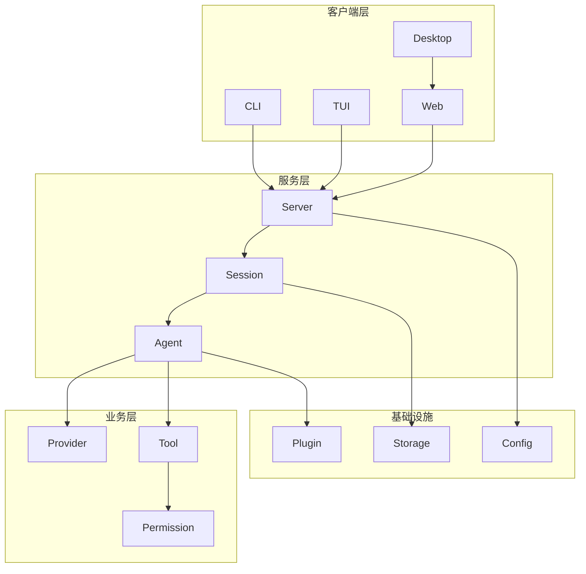

# OpenCode 架构文档

本目录包含 OpenCode 项目的架构分析文档，使用 Mermaid 图表描述核心流程。

## 文档索引

| 文档 | 描述 |
|------|------|
| [01-architecture-overview.md](./01-architecture-overview.md) | 总体架构概览 |
| [02-opencode-core.md](./02-opencode-core.md) | OpenCode 核心包架构 |
| [03-session-agent.md](./03-session-agent.md) | 会话与代理系统 |
| [04-tool-system.md](./04-tool-system.md) | 工具系统架构 |
| [05-provider-system.md](./05-provider-system.md) | Provider 系统 |
| [06-ui-client.md](./06-ui-client.md) | UI 与客户端架构 |
| [07-console-system.md](./07-console-system.md) | Console 后台管理系统 |
| [08-e2b-integration.md](./08-e2b-integration.md) | E2B 云端运行时集成指南 |

## 核心架构图



## 技术栈

- **运行时**: Bun 1.3.5
- **语言**: TypeScript 5.8
- **UI 框架**: SolidJS 1.9
- **样式**: Tailwind CSS v4
- **桌面**: Tauri v2
- **后端**: Hono
- **数据库**: PlanetScale (MySQL) + Drizzle ORM
- **AI 集成**: Vercel AI SDK
- **基础设施**: SST + Cloudflare

## 主要目录

```
opencode/
├── packages/
│   ├── opencode/     # 核心 CLI 应用
│   ├── app/          # Web UI
│   ├── ui/           # UI 组件库
│   ├── console/      # 管理控制台
│   ├── sdk/          # SDK
│   ├── desktop/      # 桌面应用
│   └── plugin/       # 插件系统
├── infra/            # 基础设施
└── docs/             # 文档
    └── architecture/ # 架构文档
```

## 查看 Mermaid 图表

这些文档中的 Mermaid 图表可以在以下环境中正确渲染：

- GitHub (自动支持)
- VS Code (安装 Markdown Preview Mermaid Support 插件)
- 任何支持 Mermaid 的 Markdown 预览器
